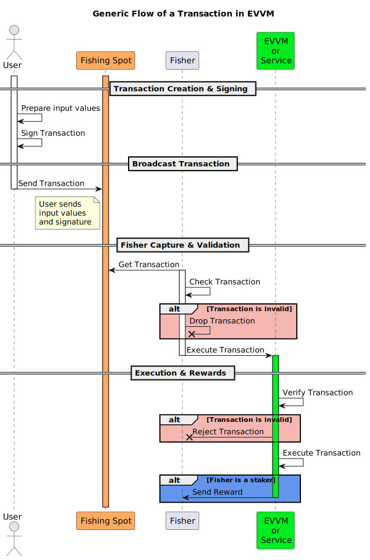

# Process of a Transaction in EVVM

Understanding how transactions work in the EVVM (Ethereum Virtual Virtual Machine) ecosystem requires examining its unique architecture. EVVM operates as a virtual blockchain where transactions are processed through a fisher-based validation and execution system, creating a gasless experience for users.



The transaction process consists of four key stages:

1. **Transaction Creation & Signing**: Users create and cryptographically sign transactions using the EIP-191 standard
2. **Transaction Broadcasting**: Signed transactions are sent to fishing spots where fishers can discover them
3. **Fisher Capture & Validation**: Fishers monitor fishing spots, capture transactions, and validate their authenticity
4. **Execution & Rewards**: Valid transactions are executed on EVVM, and rewards are distributed to participants

Each stage is explained in detail below.

## Transaction Creation & Signing

In the first stage, users construct and cryptographically sign their transactions using the EIP-191 standard for secure authentication:

### 1. Transaction Payload Construction

Every EVVM transaction follows a standardized format that includes all necessary information:

```solidity
string.concat(<evvmId>,",",<functionName>,",",<param1>,",",<param2>,",",...,",",<paramN>)
```

**Component breakdown:**

- `<evvmId>`: Unique identifier of the target EVVM instance (which virtual blockchain to use)
- `<functionName>`: Specific function to execute within EVVM (e.g., "pay", "registerUsername")
- `<param1> ... <paramN>`: Function parameters in the exact order required by the target function

### 2. EIP-191 Signature Generation

The user signs the transaction using the **EIP-191 standard**, which ensures cryptographic authenticity:

```
signature = sign(keccak256("\x19Ethereum Signed Message:\n" + len(message) + message))
```

### 3. Broadcast to Fishing Spot

Once the transaction is signed, the user broadcasts the complete package to a **fishing spot**:

**What gets broadcasted:**

- The signed transaction (with EIP-191 signature)
- Input data (function parameters)
- Target function (which EVVM function to execute)

**Where transactions can be sent (Fishing Spots):**

- **Public Mempool**: Broadcasting to blockchain mempools where anyone can see and capture transactions (e.g., Ethereum mainnet mempool)
- **Private APIs**: Direct submission to fisher-operated APIs for faster or private processing
- **Communication Channels**: Any communication medium where fishers actively monitor for EVVM transactions

### Gas Parameters for Mempool Transactions

When sending transactions to public mempools, specific gas parameters ensure the transaction waits for fisher capture instead of immediate execution:

**Recommended gas settings:**

<div style={{textAlign: 'center'}}>

$$gas = \left(  \frac{lengthOfText}{2}\right) \times 16 + 21000$$

$$maxFeePerGas = 1~gwei$$

$$maxPriorityFeePerGas = 0.0000001~gwei$$

</div>

**Why these low values:** These intentionally low gas parameters prevent miners from executing the transaction immediately, giving fishers time to capture and properly validate it through the EVVM system.

## Fisher Capture & Validation

In this critical stage, fishers act as transaction processors who monitor fishing spots, capture user transactions, and perform comprehensive validation before execution:

### 1. Transaction Capture

Fishers actively monitor various fishing spots to capture transactions:

- **Mempool Monitoring**: Scanning blockchain mempools for EVVM transactions
- **API Listening**: Receiving transactions through private APIs
- **Direct Submission**: Users can submit transactions directly to specific fishers

### 2. Comprehensive Validation

Before execution, fishers perform thorough validation:

#### **EIP-191 Signature Verification**

- Fishers verify each EIP-191 signature to ensure transaction authenticity
- Multiple signatures may be required depending on the function (EVVM + service signatures)
- Invalid signatures result in transaction rejection

#### **Nonce Verification**

Nonces are unique numbers that prevent transaction replay attacks. EVVM supports two types:

- **Synchronous Nonces**: Must follow sequential order (1, 2, 3, 4...) for each user account
- **Asynchronous Nonces**: Can be any unused number, providing more flexibility for applications
- **Service-Specific Nonces**: Individual services like NameService and Staking maintain their own nonce systems

#### **Balance & Authorization Checks**

- Sender must have sufficient token balance for the transaction
- Required permissions and access rights are validated
- Service-specific requirements (e.g., staking status, username ownership) are checked

### 3. Fisher Requirements and Incentives

**Who can be a fisher:**

- Any Ethereum address can become a fisher and process transactions
- Stakers (users who have staked MATE tokens) receive enhanced rewards for their service
- Some advanced services may require fishers to be stakers for execution privileges

**Fisher responsibilities:**

- Cover gas costs for executing transactions on the host blockchain (Ethereum, Arbitrum, etc.)
- These costs are typically offset by the rewards received from successful transaction processing

## Execution & Rewards

In the final stage, validated transactions are executed within the EVVM virtual blockchain, and the reward system distributes incentives to participants:

### 1. EVVM Execution

Once validated, the transaction executes within the EVVM virtual blockchain environment:

- **Function Calls**: The specified EVVM function or service function is invoked with the provided parameters
- **State Updates**: Smart contract states are modified according to the transaction logic (balances, ownership, etc.)
- **Token Transfers**: All required payments, fees, and token movements are processed atomically

### 2. Reward Distribution System

The EVVM ecosystem maintains a sustainable economy by rewarding participants who contribute to transaction processing and network security:

#### **Base Rewards for Stakers**

- **EVVM Contract Rewards**: Stakers receive base MATE token rewards for executing EVVM functions
- **Service Rewards**: Additional rewards from services like NameService, Staking Contract, etc.
- **Enhanced Amounts**: Stakers often receive multiplied reward amounts compared to non-stakers

#### **Priority Fee Distribution**

- **Direct Fisher Payment**: Optional priority fees paid by users are sent directly to the fisher who processes their transaction
- **Market-Based Incentives**: Higher priority fees create competition among fishers, leading to faster processing times
- **User Control**: Users decide whether to pay priority fees based on their urgency requirements

#### **Service-Specific Rewards**

Different services provide varying reward structures:

- **NameService**: Rewards for registration, renewal, and offer processing
- **Staking Contract**: Enhanced rewards for staking-related operations
- **Treasury Operations**: Rewards for deposit and withdrawal processing
- **P2P Swap**: Fees from peer-to-peer trading operations

### 3. Reward Requirements

- **Staker Verification**: Only verified stakers receive enhanced rewards
- **Successful Execution**: Rewards are only distributed upon successful transaction completion
- **Gas Coverage**: Fishers must cover host blockchain gas costs, which are typically offset by rewards

### 4. Multi-Service Coordination

EVVM enables sophisticated transactions that can interact with multiple services simultaneously:

- **Cross-Service Operations**: A single transaction can involve multiple EVVM services (payments, name registration, staking operations)
- **Coordinated Rewards**: The reward system automatically accounts for all services involved in a transaction
- **Atomic Execution**: All operations within a transaction either complete successfully together, or the entire transaction fails and reverts

## Economic Model Summary

This multi-layered reward system creates a self-sustaining ecosystem where:

- **Users** pay for services they need, often without gas fees
- **Fishers** are compensated for processing transactions and covering gas costs
- **Stakers** receive enhanced rewards for their long-term commitment to network security
- **Services** can offer incentives to encourage usage and adoption

The result is a virtual blockchain that operates efficiently while maintaining economic incentives for all participants.
