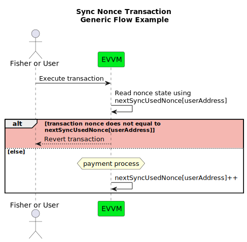

# Nonce Types in EVVM

The EVVM system implements two distinct nonce mechanisms for payment functions: `sync` and `async`. Understanding these nonce types is essential for developers interfacing with the EVVM contract, as they serve different purposes and behave in significantly different ways.

## Sync Nonce

### Definition and Behavior

The sync nonce is a consecutive counter that increments sequentially by one each time a payment transaction is executed. This mechanism closely resembles the standard nonce implementation used in Ethereum transactions.

### Key Characteristics:

- **Sequential Incrementing**: Each successful transaction increases the nonce value by exactly one unit.
- **Transaction Ordering**: Ensures transactions are processed in the order they were issued.
- **Replay Protection**: Prevents transaction replay attacks by requiring each transaction to have a unique nonce value.
- **Predictability**: The next valid nonce is always the current nonce value plus one.

### Use Cases:

- Standard payment operations where transaction order matters
- Operations that require deterministic processing sequence
- Situations where transaction dependencies exist
- Services that rely on deterministic payment processing

---

## Async Nonce

### Definition and Behavior

The async nonce is a non-consecutive number that is user-generated and transaction-specific. Unlike the sync nonce, async nonces do not follow a predetermined sequence and can be any valid number chosen by the user.

### Key Characteristics:

- **Non-sequential**: Numbers don't need to follow any particular order or sequence.
- **Uniqueness Per Address**: Each async nonce can only be used once per address.
- **User-defined**: Users can generate their own nonce values, providing flexibility in transaction preparation.
- **Parallelism**: Multiple transactions can be prepared independently without knowledge of other pending transactions.

### Use Cases:

- Parallel transaction processing
- Delayed execution scenarios
- Batch transaction preparation without dependency on execution order
- Systems where transaction preparation and submission might happen on different timelines

