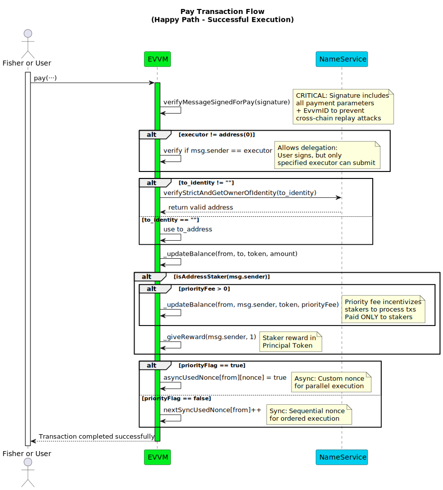
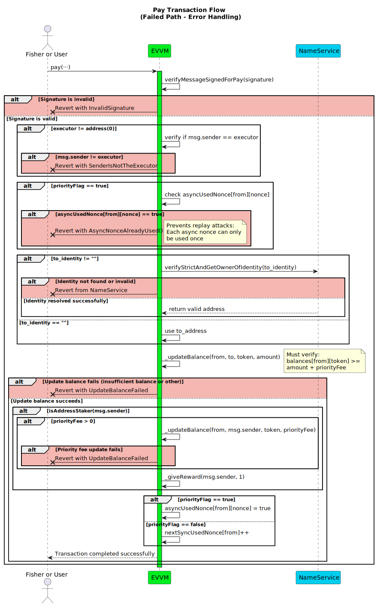

# pay Function

**Function Type**: `external`  
**Function Signature**: `pay(address,address,string,address,uint256,uint256,uint256,bool,address,bytes)`

The `pay` function executes a payment from one address to a single recipient address or identity. This is EVVM's core single payment function with intelligent staker detection and reward distribution.

**Key features:**
- **Single Payment**: Transfers tokens from one sender to one recipient (address or username)
- **Staker Detection**: Automatically detects if the executor is a staker and distributes rewards accordingly
- **Flexible Nonce Management**: Supports both synchronous and asynchronous nonce patterns
- **Identity Resolution**: Can send payments to usernames which are resolved to addresses via NameService

The function supports both synchronous and asynchronous nonce management through the `priorityFlag` parameter, making it flexible for various execution patterns and use cases. For details on nonce types, see [Nonce Types in EVVM](../02-NonceTypes.md). For signature details, see [Payment Signature Structure](../../../05-SignatureStructures/01-EVVM/01-SinglePaymentSignatureStructure.md).

### Parameters

| Field         | Type      | Description                                                                                                                                    |
|---------------|-----------|------------------------------------------------------------------------------------------------------------------------------------------------|
| `from`        | `address` | The address of the payment sender whose funds are being transferred and whose signature/nonce are validated.                                   |
| `to_address`  | `address` | Direct recipient address. Used when `to_identity` is empty.                                                                                    |
| `to_identity` | `string`  | Username/identity of the recipient. If provided, the contract resolves it to an address via the NameService.                                   |
| `token`       | `address` | The token contract address for the transfer.                                                                                                   |
| `amount`      | `uint256` | The quantity of tokens to transfer from `from` to the recipient.                                                                               |
| `priorityFee` | `uint256` | Additional fee for transaction priority. If the executor is a staker, they receive this fee as a reward.                                       |
| `nonce`       | `uint256` | Transaction nonce value. Usage depends on `priorityFlag`: if `false` (sync), this value is ignored and automatic nonce is used.                |
| `priorityFlag`| `bool`    | Execution type flag: `false` = synchronous nonce (sequential), `true` = asynchronous nonce (custom).                                          |
| `executor`    | `address` | Address authorized to execute this transaction. Use `address(0)` to allow any address to execute.                                              |
| `signature`   | `bytes`   | Cryptographic signature ([EIP-191](https://eips.ethereum.org/EIPS/eip-191)) from the `from` address authorizing this payment.                 |

:::note
The `nonce` parameter usage depends on `priorityFlag`: when `false` (synchronous), the nonce is automatically managed and the provided value is ignored; when `true` (asynchronous), the provided nonce value is used for custom ordering.
:::

### Execution Methods

The function can be executed in multiple ways:

#### Fisher Execution

1. A user signs the payment details and sends the request (parameters + signature) to a fishing spot.
2. A fisher (preferably a staker for rewards) captures the transaction and validates the request.
3. The fisher submits the transaction to the function for processing and receives rewards if they are a staker.

#### Direct Execution

1. The user or any authorized service directly calls the `pay` function.
2. If an `executor` address is specified, only that address can submit the transaction.
3. If `executor` is set to `address(0)`, anyone can execute the transaction with a valid signature.

:::tip[Additional Security Using Executor Address]
When using a service as the executor, we recommend specifying the service's address in the `executor` parameter for additional security.
:::

### Workflow

1. **Signature Verification**: Validates the `signature` against the `from` address and other parameters using `verifyMessageSignedForPay`. For synchronous payments (`priorityFlag = false`), uses `nextSyncUsedNonce[from]` as the nonce; for asynchronous payments (`priorityFlag = true`), uses the provided `nonce` parameter. Reverts with `InvalidSignature` on failure.
2. **Executor Validation**: If `executor` is not `address(0)`, checks that `msg.sender` matches the `executor` address. Reverts with `SenderIsNotTheExecutor` if they don't match.
3. **Asynchronous Nonce Verification**: For asynchronous payments only (`priorityFlag = true`), checks if the provided `nonce` has already been used for the `from` address by consulting the `asyncUsedNonce` mapping. Reverts with `InvalidAsyncNonce` if the nonce has already been used.
4. **Resolve Recipient Address**: Determines the final recipient address:
   - If `to_identity` is provided (not empty), resolves the identity to an owner address using `verifyStrictAndGetOwnerOfIdentity` from the NameService contract.
   - If `to_identity` is empty, uses the provided `to_address`.
5. **Balance Update**: Executes the payment transfer using the `_updateBalance` function, sending `amount` of `token` from the `from` address to the resolved recipient address. Reverts with `UpdateBalanceFailed` on transfer failure.
6. **Staker Benefits Distribution**: If the executor (`msg.sender`) is a registered staker:
   - **Priority Fee Transfer**: If `priorityFee > 0`, transfers the `priorityFee` amount of `token` from the `from` address to the `msg.sender` (executor) as a staker reward.
   - **Principal Token Reward**: Grants 1x reward amount in principal tokens to the `msg.sender` (executor) using the `_giveReward` function.
7. **Nonce Management**: Updates nonce tracking based on execution type:
   - **Asynchronous** (`priorityFlag = true`): Marks the specific `nonce` as used (`true`) for the `from` address in the `asyncUsedNonce` mapping.
   - **Synchronous** (`priorityFlag = false`): Increments the synchronous nonce counter for the `from` address to prevent replay attacks.

:::info

For more information about the signature structure, refer to the [Payment Signature Structure section](../../../05-SignatureStructures/01-EVVM/01-SinglePaymentSignatureStructure.md).

:::

:::tip
**Need to send from one user to multiple recipients?**  
Use [dispersePay](./03-dispersePay.md) to send tokens from a single sender to multiple different addresses or identities in one transaction.

**Need to execute multiple separate payments?**  
Use [payMultiple](./02-payMultiple.md) to process several individual `pay` operations within a single transaction, each with their own sender, recipient, and parameters.
:::

