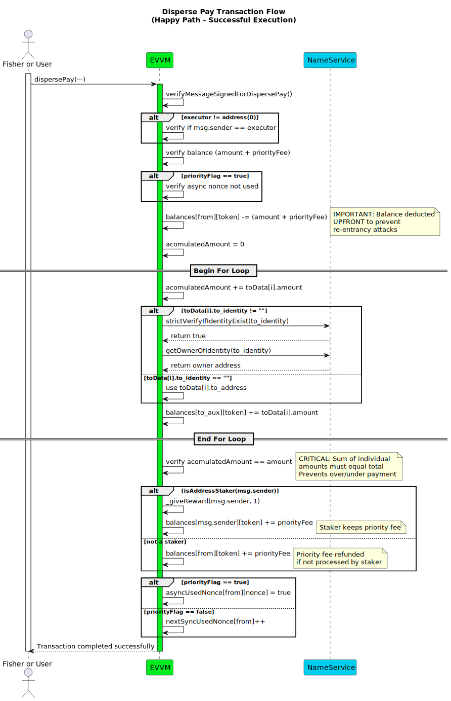
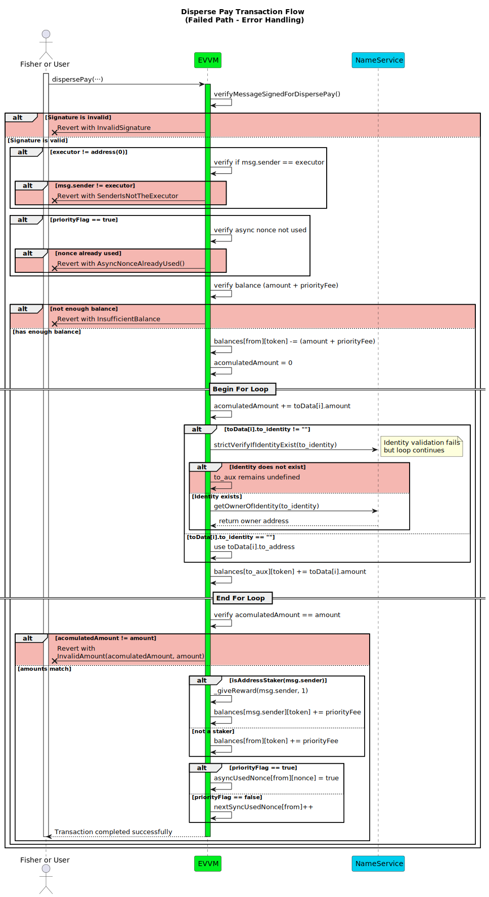

# dispersePay Function

**Function Type**: `external`  
**Function Signature**: `dispersePay(address,(uint256,address,string)[],address,uint256,uint256,uint256,bool,address,bytes)`

Distributes tokens from a single sender to multiple recipients with efficient single-source multi-recipient payment distribution. This function uses a single signature to authorize distribution to multiple recipients, supports both direct addresses and identity-based recipients, and includes integrated priority fee and staker reward systems.

The signature structure for these payments is detailed in the [Disperse Payment Signature Structure](../../../05-SignatureStructures/01-EVVM/02-DispersePaySignatureStructure.md) section.

## Parameters

| Parameter      | Type                    | Description                                                                                                                       |
| -------------- | ----------------------- | --------------------------------------------------------------------------------------------------------------------------------- |
| `from`         | `address`               | The address of the payment sender whose funds will be distributed.                                                                |
| `toData`       | `DispersePayMetadata[]` | An array detailing each recipient's address/identity and the amount they should receive. See struct below.                        |
| `token`        | `address`               | The token address to be distributed.                                                                                              |
| `amount`       | `uint256`               | The total amount of tokens to distribute across all recipients. Must equal the sum of individual amounts in `toData`.             |
| `priorityFee`  | `uint256`               | Fee amount for the transaction executor (distributed to stakers as reward).                                                       |
| `nonce`        | `uint256`               | Transaction nonce for replay protection. Usage depends on the `priorityFlag`.                                                     |
| `priorityFlag` | `bool`                  | Determines nonce type: `true` for asynchronous (custom nonce), `false` for synchronous (sequential nonce).                        |
| `executor`     | `address`               | Address authorized to execute this transaction. Use `address(0)` to allow any address to execute.                                 |
| `signature`    | `bytes`                 | Cryptographic signature ([EIP-191](https://eips.ethereum.org/EIPS/eip-191)) from the `from` address authorizing the distribution. |

:::info

If you want to know more about the signature structure, refer to the [Disperse Payment Signature Structure section](../../../05-SignatureStructures/01-EVVM/02-DispersePaySignatureStructure.md).

:::

## `DispersePayMetadata` Struct

Defines the payment details for a single recipient within the `toData` array.

```solidity
struct DispersePayMetadata {
   uint256 amount;
   address to_address;
   string to_identity;
}
```

| Field         | Type      | Description                                                                                                  |
| ------------- | --------- | ------------------------------------------------------------------------------------------------------------ |
| `amount`      | `uint256` | The amount of tokens to be sent to this recipient.                                                           |
| `to_address`  | `address` | Direct recipient address. Used when `to_identity` is an empty string (`""`).                                           |
| `to_identity` | `string`  | Username/identity of the recipient. If provided, the contract resolves it to an address via the NameService. |

:::note
If `to_identity` is an empty string (`""`), the `to_address` field will be used as the recipient's destination address. Otherwise, the contract attempts to resolve the `to_identity` to its owner address using the NameService.
:::

## Execution Methods

This function can be executed by any address, with different behavior depending on whether the executor is a staker:

### Fisher Execution

- A fisher collects multiple disperse payment requests with valid signatures from users through fishing spots.
- The fisher submits the transaction and receives priority fees and principal token rewards if they are a staker.

### Direct Execution

- A user or service directly calls `dispersePay` with appropriate authorization.
- Staker executors receive priority fees and principal token rewards for processing.

:::tip
When using a service as the executor, we recommend specifying the service's address in the `executor` parameter for additional security.
:::

## Workflow {#disperse-pay-workflow}

1. **Signature Verification**: Validates the `signature` against the reconstructed message hash using `verifyMessageSignedForDispersePay`. The message includes a hash of the `toData` array for integrity. Uses the appropriate nonce based on `priorityFlag`. Reverts with `InvalidSignature` if validation fails.

2. **Executor Validation**: If `executor` is not `address(0)`, checks that `msg.sender` matches the `executor` address. Reverts with `SenderIsNotTheExecutor` if they don't match.

3. **Async Nonce Verification**: If `priorityFlag` is `true` (asynchronous), checks if the custom nonce hasn't been used by consulting the `asyncUsedNonce` mapping. Reverts with `AsyncNonceAlreadyUsed()` if already used. 

4. **Balance Verification**: Checks that the `from` address has sufficient balance to cover both `amount` and `priorityFee`. Reverts with `InsufficientBalance` if insufficient.

5. **Balance Deduction**: Subtracts the total `amount` and `priorityFee` from the sender's balance upfront.

6. **Distribution Loop**: Iterates through each recipient in the `toData` array:

   - **Amount Tracking**: Maintains a running total (`accumulatedAmount`) of distributed amounts
   - **Recipient Resolution**:
     - If `to_identity` is provided, verifies the identity exists using `strictVerifyIfIdentityExist` and resolves it to an owner address using `getOwnerOfIdentity`
     - If `to_identity` is empty, uses `to_address`
   - **Token Distribution**: Adds the specified amount to the recipient's balance

7. **Amount Validation**: Verifies that the total distributed amount (`accumulatedAmount`) exactly matches the specified `amount` parameter. Reverts with `InvalidAmount` if mismatch.

8. **Staker Benefits**:

   - If the executor is a staker (`isAddressStaker(msg.sender)`):
     - Grants 1 principal token reward using `_giveReward`
     - Transfers the `priorityFee` to the executor
   - If the executor is not a staker:
     - Returns the `priorityFee` to the original sender

9. **Nonce Update**: Marks the nonce as used to prevent replay attacks:
   - **Async (priorityFlag = true)**: Marks the custom nonce as used in `asyncUsedNonce`
   - **Sync (priorityFlag = false)**: Increments the sequential nonce in `nextSyncUsedNonce`



