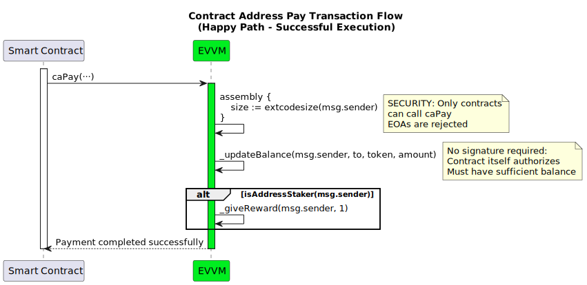
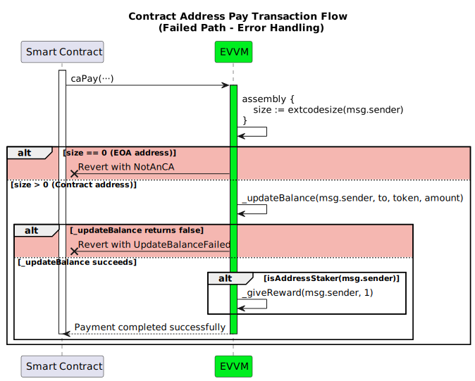

# caPay Function

**Function Type**: `external`  
**Function Signature**: `caPay(address,address,uint256)`  

Contract-to-address payment function designed for authorized smart contracts to distribute tokens without signature verification. This function allows registered smart contracts to efficiently transfer tokens using direct balance manipulation, primarily for automated distributions and system payouts.

## Key Features

- **Contract-Only Execution:** Only smart contracts (non-EOA addresses) can call this function, verified via bytecode presence
- **No Signature Required:** Bypasses signature verification as authorization is implicit through contract execution
- **No Nonce Management:** Does not use EVVM nonce systems since contracts rely on blockchain transaction nonces
- **Automated Distributions:** Designed for staking rewards, NameService fees, and other automated system payouts
- **Staker Rewards:** Contracts that are registered stakers receive principal token rewards for successful transfers

## Parameters

| Field    | Type      | Description                                                       |
| -------- | --------- | ----------------------------------------------------------------- |
| `to`     | `address` | The recipient's address for the token transfer.                   |
| `token`  | `address` | The token address to transfer.                                    |
| `amount` | `uint256` | The quantity of tokens to transfer from the calling contract.     |

## Workflow

1. **Contract Verification**: Validates that the caller (`msg.sender`) is a smart contract by checking its bytecode size using `extcodesize`. Reverts with `NotAnCA` if the caller is an Externally Owned Account (EOA).

2. **Balance Update**: Executes the token transfer using the `_updateBalance` function:
   - Verifies the calling contract has sufficient token balance
   - Debits the `amount` from the calling contract's balance
   - Credits the `amount` to the recipient's balance
   - Reverts with `UpdateBalanceFailed` if the transfer fails

3. **Staker Reward**: If the calling contract is a registered staker (`isAddressStaker(msg.sender)`), grants 1 principal token reward using `_giveReward`. 

