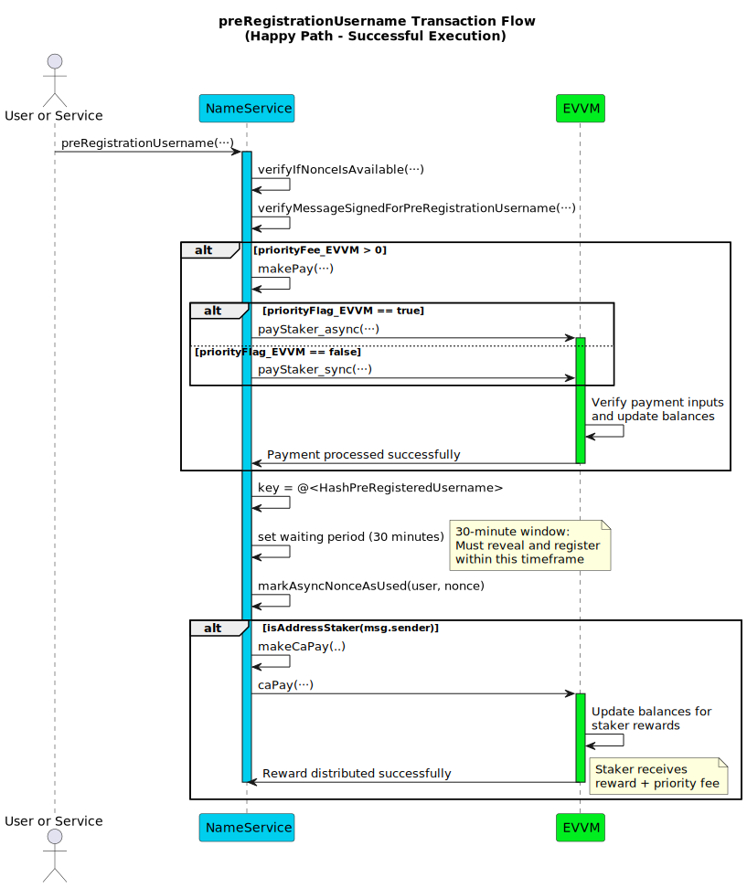
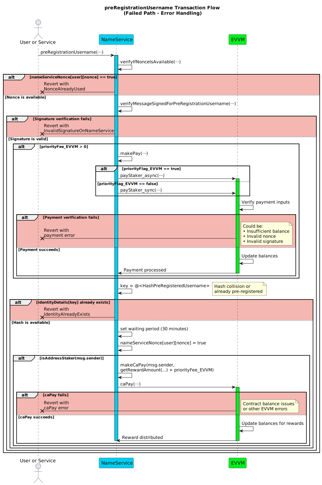

# preRegistrationUsername

**Function Type**: `public`  
**Function Signature**: `preRegistrationUsername(address,bytes32,uint256,bytes,uint256,uint256,bool,bytes)`

Pre-registers a username hash to prevent front-running attacks during the registration process. This function creates a temporary reservation that can be registered after a 30-minute waiting period. The function uses a commitment-reveal scheme where users first commit to a hash of their desired username plus a secret number.

## Parameters

| Parameter                   | Type      | Description                                                                                                                     |
| --------------------------- | --------- | ------------------------------------------------------------------------------------------------------------------------------- |
| `user`                      | `address` | The address of the end-user initiating the pre-registration.                                                                    |
| `hashPreRegisteredUsername` | `bytes32` | The pre-commitment hash calculated as `keccak256(abi.encodePacked(username, clowNumber))`.                                      |
| `nonce`                     | `uint256` | The user's nonce specific to this NameService contract for replay protection of this pre-registration action.                           |
| `signature`                 | `bytes`   | The EIP-191 signature from `user` authorizing this pre-registration action.                                                     |
| `priorityFee_EVVM`          | `uint256` | Optional fee (in principal tokens) paid by `user` to the `msg.sender` (staker executing the transaction) via the EVVM contract. |
| `nonce_EVVM`                | `uint256` | **Required if `priorityFee_EVVM > 0`**. `user`'s nonce for the EVVM payment function call used only to pay the priority fee.    |
| `priorityFlag_EVVM`         | `bool`    | **Required if `priorityFee_EVVM > 0`**. Priority flag (sync/async) for the EVVM payment call paying the priority fee.           |
| `signature_EVVM`            | `bytes`   | **Required if `priorityFee_EVVM > 0`**. `user`'s signature authorizing the EVVM payment call paying the priority fee.           |

:::note

- The EVVM payment signature (`signature_EVVM`) is only needed if paying a priority fee and follows the [Single Payment Signature Structure](../../../05-SignatureStructures/01-EVVM/01-SinglePaymentSignatureStructure.md).
- The NameService pre-registration signature (`signature`) follows the [Pre-Registration Signature Structure](../../../05-SignatureStructures/02-NameService/01-preRegistrationUsernameStructure.md).
- The EVVM parameters (`nonce_EVVM`, `priorityFlag_EVVM`, `signature_EVVM`) are only required and processed if `priorityFee_EVVM` is greater than zero.

:::

## Hash Username Structure

The `hashPreRegisteredUsername` is calculated off-chain by the user using SHA3-256 (keccak256):

```solidity
keccak256(abi.encodePacked(username, clowNumber));
```

Where:

- `username` (string): The desired username.
- `clowNumber` (uint256): A secret number chosen by the user, required later during the `registrationUsername` step to validate the commitment.

## Execution Methods

This function can be executed by any address, with staker rewards only distributed to stakers.

### Fisher Execution

When the executor is the fisher:

1. The user sends the payment request to the fishing spot
2. The fisher captures the transaction and validates all parameters
3. The fisher submits the transaction to the contract for processing

### Direct Execution

When the executor is the user or a service:

1. The user/service submits their transaction directly to the contract

## Workflow

1. **NameService Nonce Verification**: Checks if the provided `nonce` is unused for the `user` using the `verifyIfNonceIsAvailable` modifier. Reverts if used.

2. **Pre-registration Signature Verification**: Verifies the `signature` provided by `user` using `verifyMessageSignedForPreRegistrationUsername`. Reverts with `InvalidSignatureOnNameService` if invalid.

3. **Priority Fee Processing**: If `priorityFee_EVVM > 0`, calls the `makePay` function to process the priority fee payment through EVVM using the provided EVVM parameters.

4. **Hash Storage**: Records the pre-registration by storing the `hashPreRegisteredUsername` with:

   - Key: `"@" + hashPreRegisteredUsername` (converted to string)
   - Owner: `user`
   - Expiration: `block.timestamp + 30 minutes`
   - Flags: Marked as not a username (`flagNotAUsername = 0x01`)

5. **Nonce Management**: Marks the NameService `nonce` as used for the `user` in the `nameServiceNonce` mapping.

6. **Staker Rewards**: If the executor (`msg.sender`) is a staker (`isAddressStaker(msg.sender)`), distributes rewards via `makeCaPay`:
   - Base MATE reward (`getRewardAmount()`)
   - Plus the `priorityFee_EVVM` amount



