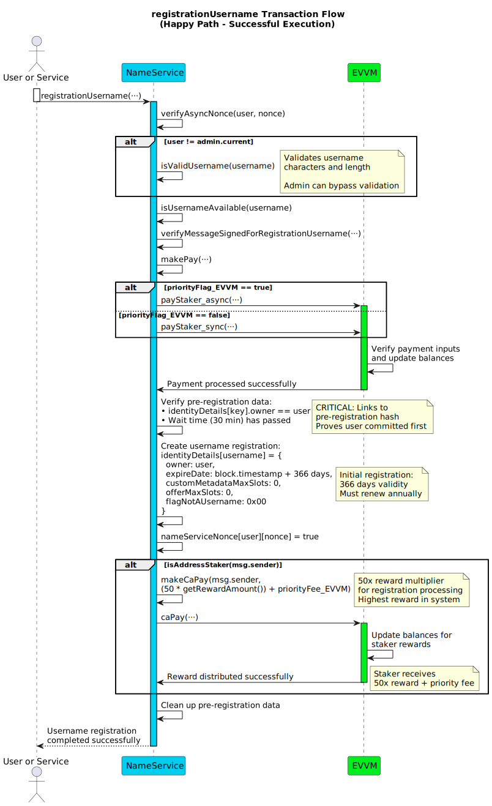
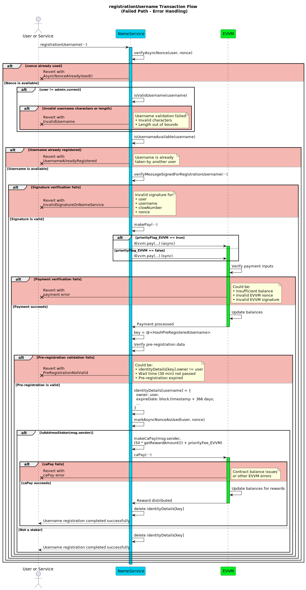

# registrationUsername

**Function Type**: `public`  
**Function Signature**: `registrationUsername(address,string,uint256,uint256,bytes,uint256,uint256,bool,bytes)`

Completes username registration using a pre-registration commitment. The user reveals the `username` and `clowNumber` to validate their prior pre-registration commit. This function processes the required registration fee payment via EVVM and finalizes the username registration, associating it with the user.

**Requirements:**

- A valid pre-registration corresponding to `keccak256(abi.encodePacked(username, clowNumber))` must exist and be associated with `user`.
- A minimum waiting period (30 minutes) must have passed since the pre-registration timestamp.
- The `user` must pay the registration fee plus any optional priority fee via the EVVM contract.

## Parameters

| Parameter           | Type      | Description                                                                                                                       |
| ------------------- | --------- | --------------------------------------------------------------------------------------------------------------------------------- |
| `user`              | `address` | The address of the end-user registering the username (must match the address used in pre-registration).                           |
| `username`          | `string`  | The desired username being registered (must match the value used to generate the pre-registered hash).                            |
| `clowNumber`        | `uint256` | The secret number used with `username` during pre-registration hash calculation. Revealing it proves ownership of the commitment. |
| `nonce`             | `uint256` | The user's NameService nonce specific to this registration action.                                                                        |
| `signature`         | `bytes`   | The EIP-191 signature from `user` authorizing this registration action.                                                           |
| `priorityFee_EVVM`  | `uint256` | Optional fee (in MATE) paid **by `user`** to the `msg.sender` (executor) via EVVM, added to the registration fee payment.         |
| `nonce_EVVM`        | `uint256` | `user`'s nonce for the EVVM payment function call used to pay the total amount.                                                   |
| `priorityFlag_EVVM` | `bool`    | Priority flag (sync/async) for the EVVM payment function call.                                                                    |
| `signature_EVVM`    | `bytes`   | `user`'s signature authorizing the EVVM call to transfer the total payment (Registration Fee + `priorityFee_EVVM`).               |

:::note

- The EVVM payment signature (`signature_EVVM`) covers the **total** payment amount and is paid by `user`. It uses the [Single Payment Signature Structure](../../../05-SignatureStructures/01-EVVM/01-SinglePaymentSignatureStructure.md).
- The NameService registration signature (`signature`) must be generated by `user` and follows the [Registration Signature Structure](../../../05-SignatureStructures/02-NameService/02-registrationUsernameStructure.md).
- The EVVM parameters are mandatory as a registration fee is always required.

:::

## Execution Methods

Can be executed by any address (`msg.sender`). Rewards are only distributed if the executor is a staker.

### Fisher Execution

When the executor is the fisher:

1. The user sends the payment request to the fishing spot
2. The fisher captures the transaction and validates all parameters
3. The fisher submits the transaction to the contract for processing

### Direct Execution

When the executor is the user or a service:

1. The user/service submits their transaction directly to the contract

## Workflow

1. **NameService Nonce Verification**: Checks if the provided `nonce` is unused for the `user` using the `verifyIfNonceIsAvailable` modifier. Reverts if used.

2. **Username Validation**: Unless `user` is the admin address, calls `isValidUsername` to validate the `username` against character set and length rules. Reverts if invalid.

3. **Username Availability Check**: Calls `isUsernameAvailable` to ensure the `username` is not already registered. Reverts with `UsernameAlreadyRegistered` if unavailable.

4. **Registration Signature Verification**: Verifies the `signature` provided by `user` using `verifyMessageSignedForRegistrationUsername`. Reverts with `InvalidSignatureOnNameService` if invalid.

5. **Registration Payment**: Calls `makePay` to process the registration fee payment:

   - Calculates the required registration fee using `getPriceOfRegistration(username)` with dynamic pricing
   - If username has existing offers, uses market-based pricing via `seePriceToRenew` logic
   - If no offers exist, uses standard rate of 100x current EVVM reward amount
   - Transfers the total payment amount from the `user` via EVVM
   - Uses the provided EVVM parameters for authorization

6. **Pre-Registration Validation**:

   - Reconstructs the expected hash: `keccak256(abi.encodePacked(username, clowNumber))`
   - Retrieves pre-registration data stored under key `"@<hash_string>"`
   - Verifies the stored user matches `user` and the waiting period has passed
   - Reverts with `PreRegistrationNotValid` if validation fails

7. **Username Registration**: Creates the final username registration in `identityDetails` with:

   - Owner: `user`
   - Expiration: `block.timestamp + 366 days`
   - Flags: Marked as username (`flagNotAUsername = 0x00`)

8. **Nonce Management**: Marks the `nonce` as used for the `user` in the `nameServiceNonce` mapping.

9. **Staker Rewards**: If the executor is a staker, distributes rewards via `makeCaPay`:

   - Base reward: `50 * getRewardAmount()`
   - Plus the `priorityFee_EVVM` amount

10. **Cleanup**: Deletes the pre-registration entry to free storage.

