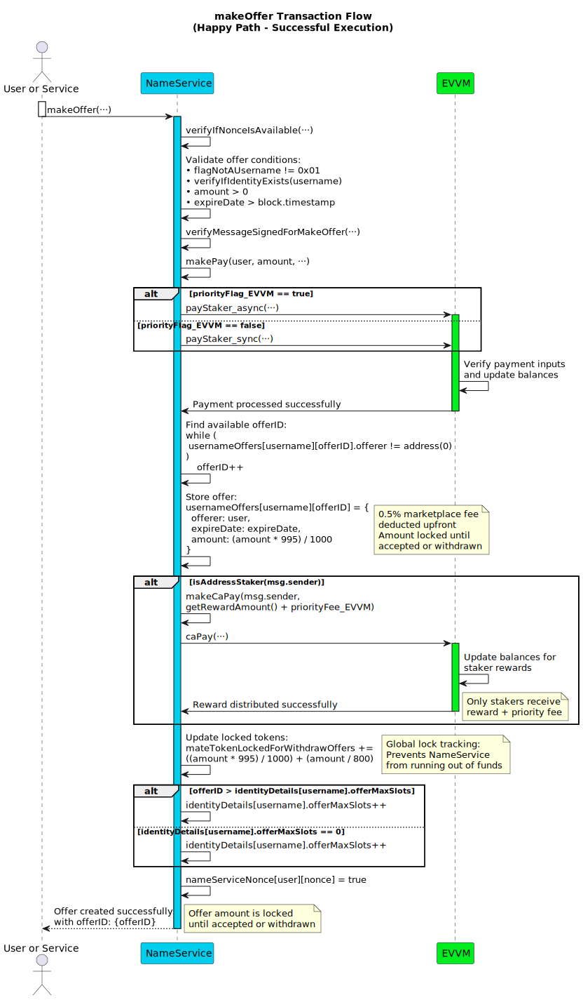
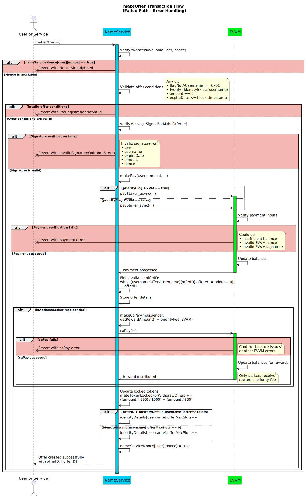

# makeOffer

**Function Type**: `public`  
**Function Signature**: `makeOffer(address,string,uint256,uint256,uint256,bytes,uint256,uint256,bool,bytes)`

Allows a user (`_user`) to make a formal, time-limited offer to purchase an existing username (`_username`) by committing principal tokens. This function can be executed by any address; **if the executor (`msg.sender`) is a staker they receive executor rewards**.

## Parameters

| Parameter           | Type      | Description                                                                                                                                    |
| ------------------- | --------- | ---------------------------------------------------------------------------------------------------------------------------------------------- |
| `user`              | `address` | The address of the end-user making the offer (offeror).                                                                                        |
| `username`          | `string`  | The target username for which the offer is being made.                                                                                         |
| `expireDate`        | `uint256` | The Unix timestamp when this offer automatically expires if not accepted or withdrawn.                                                         |
| `amount`            | `uint256` | The total gross amount of principal tokens the offeror commits. This includes the actual offer value plus a 0.5% service fee.                  |
| `nonce`             | `uint256` | The offeror's nonce specific to this NameService contract for replay protection of this `makeOffer` action.                                            |
| `signature`         | `bytes`   | The EIP-191 signature from `user` authorizing this make offer action.                                                                          |
| `priorityFee_EVVM`  | `uint256` | Optional fee (in principal tokens) paid by `user` to the `msg.sender` (staker executing the transaction) via the EVVM contract for prioritized processing. |
| `nonce_EVVM`        | `uint256` | `user`'s nonce for the EVVM payment function call used to transfer the total payment.                                                          |
| `priorityFlag_EVVM` | `bool`    | Priority flag (sync/async) for the EVVM payment function call.                                                                                 |
| `signature_EVVM`    | `bytes`   | `user`'s signature authorizing the EVVM payment call to transfer the total payment.                                                            |

**Returns**: `offerID` - Unique identifier for the created offer

:::note

- The EVVM payment signature (`signature_EVVM`) covers the **total** payment amount and is paid by the offeror (`user`). It uses the [Single Payment Signature Structure](../../../05-SignatureStructures/01-EVVM/01-SinglePaymentSignatureStructure.md).
- The NameService make offer signature (`signature`) must be generated by `user` and follows the [Make Offer Signature Structure](../../../05-SignatureStructures/02-NameService/03-makeOfferStructure.md).

:::

## Execution Methods

This function can be executed by any address.

### Fisher Execution

When the executor is the fisher:

1. The user sends the payment request to the fishing spot
2. The fisher captures the transaction and validates all parameters
3. The fisher submits the transaction to the contract for processing

### Direct Execution

When the executor is the user or a service:

1. The user/service submits their transaction directly to the contract

## Workflow

1. **NameService Nonce Verification**: Calls internal `verifyAsyncNonce(user, nonce)` which reverts with `AsyncNonceAlreadyUsed()` if the nonce was already used.

2. **Offer Validation**: Validates the offer parameters:

   - Ensures the target `username` exists and is not flagged as a pre-registration
   - Verifies `amount > 0` and `expireDate > block.timestamp`
   - Reverts with `PreRegistrationNotValid` if validation fails

3. **Make Offer Signature Validation**: Verifies the `signature` provided by `user` using `verifyMessageSignedForMakeOffer`. Reverts with `InvalidSignatureOnNameService` if invalid.

4. **Payment Execution**: Calls `makePay` to transfer the `amount` and `priorityFee_EVVM` from `user` to the service via EVVM. Reverts if payment fails.

5. **Offer ID Assignment**: Finds the next available sequential ID for an offer by looping through existing offer slots until an empty one (`address(0)` offerer) is found.

6. **Offer Creation**: Creates and stores the offer in the `usernameOffers` mapping with:

   - `offerer`: `user`
   - `expireDate`: provided expiration timestamp
   - `amount`: net offer amount (99.5% of input `amount` after 0.5% fee)

7. **Reward Distribution**: Distributes rewards to the executor via `makeCaPay`:

   - Base MATE reward (`getRewardAmount()`)
   - Plus 0.125% of the gross `amount`
   - Plus the `priorityFee_EVVM`

8. **Token Locking**: Updates internal accounting for locked principal tokens (variable `principalTokenTokenLockedForWithdrawOffers` in the contract) to track funds reserved for future withdrawals.

9. **Offer Slot Management**: Updates the username's `offerMaxSlots` if this offer exceeds the current maximum slot count.

10. **Nonce Management**: Calls internal `markAsyncNonceAsUsed(user, nonce)` to mark the provided `nonce` as used and prevent replays.

