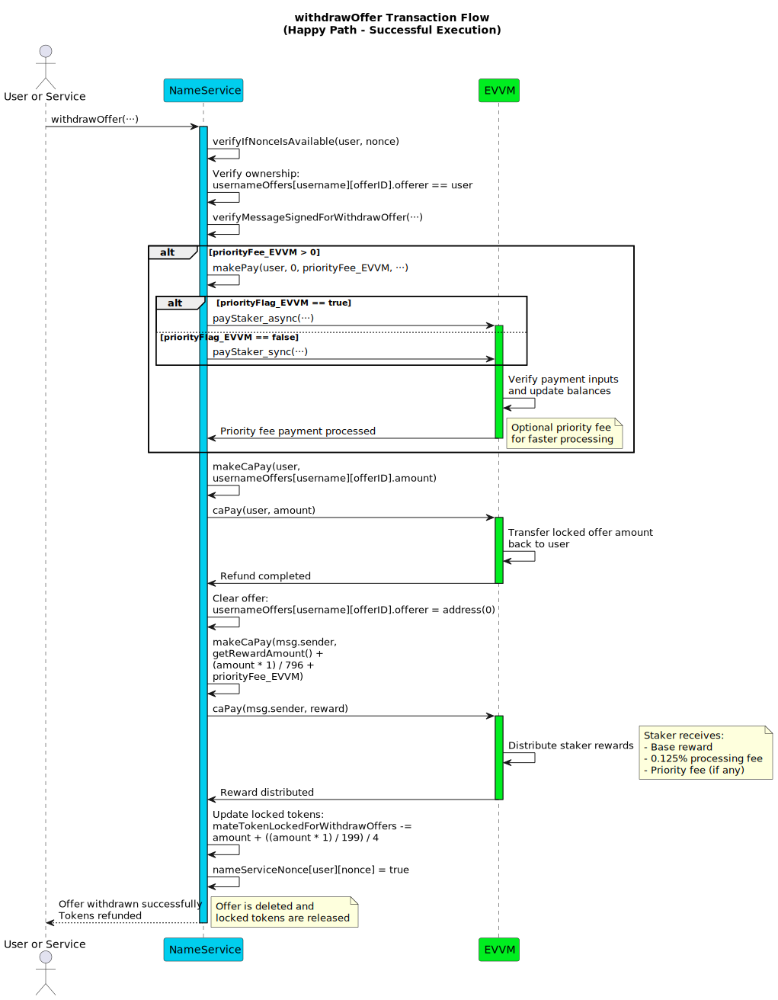
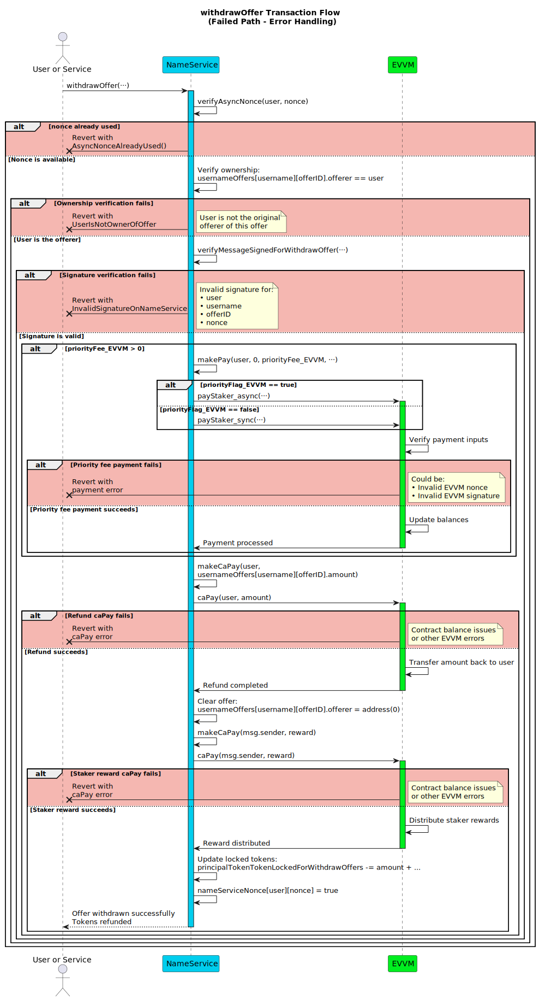

# withdrawOffer

**Function Type**: `public`  
**Function Signature**: `withdrawOffer(address,string,uint256,uint256,bytes,uint256,uint256,bool,bytes)`

Withdraws a marketplace offer and refunds the locked tokens to the original offeror. This action cancels the offer and returns the escrowed principal tokens. Can only be called by the offer creator.

## Parameters

| Parameter           | Type      | Description                                                                                                                                    |
| ------------------- | --------- | ---------------------------------------------------------------------------------------------------------------------------------------------- |
| `user`              | `address` | The address of the user who originally placed the offer and is now withdrawing it.                                                             |
| `username`          | `string`  | The target username associated with the offer being withdrawn.                                                                                 |
| `offerID`           | `uint256` | The unique identifier of the specific offer to be withdrawn.                                                                                   |
| `nonce`             | `uint256` | The user's nonce specific to the NameService contract for this `withdrawOffer` action's replay protection.                                             |
| `signature`         | `bytes`   | The EIP-191 signature from `user` authorizing this withdraw offer action.                                                                      |
| `priorityFee_EVVM`  | `uint256` | Optional fee (in MATE) paid by `user` to the `msg.sender` (staker executing the transaction) via the EVVM contract for prioritized processing. |
| `nonce_EVVM`        | `uint256` | **Required if `priorityFee_EVVM > 0`**. `user`'s nonce for the EVVM payment call used only to pay the priority fee.                            |
| `priorityFlag_EVVM` | `bool`    | **Required if `priorityFee_EVVM > 0`**. Priority flag (sync/async) for the EVVM payment call paying the priority fee.                          |
| `signature_EVVM`    | `bytes`   | **Required if `priorityFee_EVVM > 0`**. `user`'s signature authorizing the EVVM payment call paying the priority fee.                          |

:::note Signature Links & EVVM Payment

- The EVVM payment signature (`signature_EVVM`) covers the **total** amount and uses the [Single Payment Signature Structure](../../../05-SignatureStructures/01-EVVM/01-SinglePaymentSignatureStructure.md).
- The NameService withdraw offer signature (`signature`) follows the [Withdraw Offer Signature Structure](../../../05-SignatureStructures/02-NameService/04-withdrawOfferStructure.md).
- The EVVM parameters facilitate the transfer of the offer funds and any optional priority fee from the offeror (`user`).

:::

## Execution Methods

This function can be executed by any address.

### Fisher Execution

When the executor is the fisher:

1. The user sends the payment request to the fishing spot
2. The fisher captures the transaction and validates all parameters
3. The fisher submits the transaction to the contract for processing

### Direct Execution

When the executor is the user or a service:

1. The user/service submits their transaction directly to the contract

## Workflow

Failure at validation steps typically reverts the transaction.

1.  **NameService Nonce Verification**: Calls internal `verifyAsyncNonce(user, nonce)` which reverts with `AsyncNonceAlreadyUsed()` if the nonce was already used.
2.  **Offerer Verification**: Retrieves the offer data associated with `_username` and `_offerID` from the `usernameOffers` mapping. Verifies that the `_user` parameter matches the `offerer` address stored in the retrieved offer data. Reverts if `_user` is not the recorded offerer or if the specified offer does not exist.
3.  **Withdrawal Signature Validation**: Verifies the `_signature` provided by `_user` (which authorizes this NameService withdrawal action) using the `verifyMessageSignedForWithdrawOffer` function. Reverts if the signature is invalid according to the [Withdraw Offer Signature Structure](../../../05-SignatureStructures/02-NameService/04-withdrawOfferStructure.md).
4.  **EVVM Payment Execution (Optional Priority Fee)**: If `_priorityFeeForFisher` is greater than zero:
    - Calls the internal helper `makePay`, which invokes `IEvvm.pay(...)` to perform the EVVM payment.
    - Uses the provided `_nonce_Evvm`, `_priority_Evvm`, and `_signature_Evvm` parameters to authorize the EVVM payment.
    - This action attempts to transfer the `_priorityFeeForFisher` amount of principal tokens from the `_user` address to the `msg.sender` address via the EVVM contract mechanism.
    - Reverts if this EVVM payment process fails.
5.  **Withdrawal Offer Payment Execution (Return Funds)**: Calls an internal helper function (e.g., `makeCaPay`) responsible for refunding the escrowed offer funds. It retrieves the **total** `amount` stored in the `usernameOffers[_username][_offerID]` data structure and transfers this full amount of principal tokens from the NameService contract's escrow back to the original offeror (`_user`). Reverts if this principal token transfer fails.
6.  **Offer Cleanup**: Modifies the state of the withdrawn offer in the `usernameOffers` mapping by setting the `offerer` field for the specific `_username` and `_offerID` to `address(0)`. This effectively invalidates the offer slot.
7.  **Reward Distribution (to Executor)**: Calls an internal helper function (e.g., `makeCaPay`) to distribute rewards in principal tokens to `msg.sender` (the executor). The rewards consist of:
    - A base MATE reward, typically fetched from the EVVM contract (e.g., 1 \* `seeMateReward()`).
    - The `_priorityFeeForFisher`, if it was greater than zero and successfully paid in Step 4.
    - An additional amount calculated based on the withdrawn offer's value: 0.125% of the `amount` stored in `usernameOffers[_username][_offerID]`. _(This is derived from the 0.5% fee structure associated with the offer)._
8.  **Nonce Management**: Calls internal `markAsyncNonceAsUsed(user, nonce)` to mark the provided `_nonce` as used and prevent replay of this withdrawal action.

