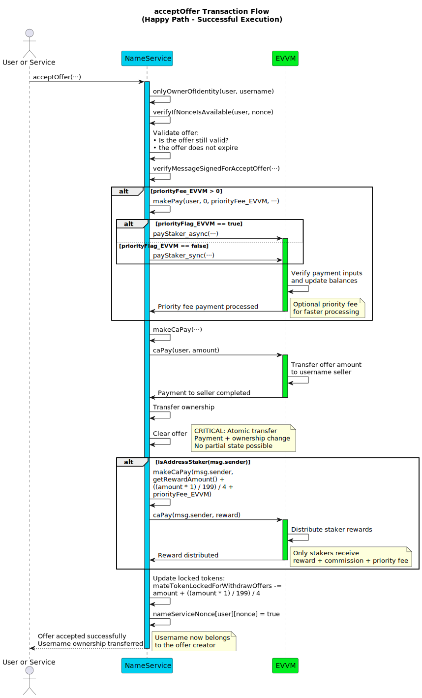
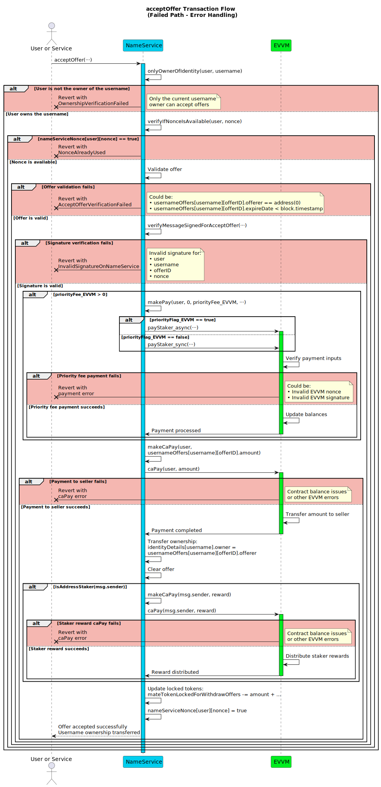

# acceptOffer

**Function Type**: `public`  
**Function Signature**: `acceptOffer(address,string,uint256,uint256,bytes,uint256,uint256,bool,bytes)`
**Function Selector**: `0xae36fe72`

Allows the current owner (`user`) of a username (`username`) to accept a specific, active offer (`offerID`) made by another user. Accepting the offer triggers the transfer of the agreed principal tokens from the offeror to the owner, and transfers the ownership of the username to the original offeror.

## Parameters

| Parameter Name      | Type      | Description                                                                        |
| ------------------- | --------- | ---------------------------------------------------------------------------------- |
| `user`              | `address` | The address of the **current owner** of the `username` who is accepting the offer. |
| `username`          | `string`  | The username associated with the offer being accepted.                             |
| `offerID`           | `uint256` | The unique identifier of the specific offer being accepted.                        |
| `nonce`             | `uint256` | The nonce value for the NameService signature.                                     |
| `signature`         | `bytes`   | The NameService accept offer signature.                                            |
| `priorityFee_EVVM`  | `uint256` | The priority fee amount for EVVM payment.                                          |
| `nonce_EVVM`        | `uint256` | The nonce value for the EVVM payment signature.                                    |
| `priorityFlag_EVVM` | `bool`    | True for async payment, false for sync payment.                                    |
| `signature_EVVM`    | `bytes`   | The EVVM payment signature.                                                        |

:::note Signature Links & EVVM Payment

- The EVVM payment signature (`signature_EVVM`) is used to pay for the operation and priority fees, following the [Single Payment Signature Structure](../../../05-SignatureStructures/01-EVVM/01-SinglePaymentSignatureStructure.md).
- The NameService accept offer signature (`signature`) must be generated by the **current owner (`user`)** and follows the [Accept Offer Signature Structure](../../../05-SignatureStructures/02-NameService/05-acceptOfferStructure.md).
- The offer amount and token are retrieved from the stored offer data, not passed as parameters.

:::

## Execution Methods

This function can be executed by any address.

## Workflow

Failure at validation steps typically reverts the transaction.

1. **Username Owner Verification**: Checks if the provided `_user` address is the registered owner of the `_username` (e.g., using an internal ownership check like `onlyAdminOfIdentity`). Reverts if `_user` is not the owner.
2. **NameService Nonce Verification**: Calls internal `verifyAsyncNonce(user, nonce)` which reverts with `AsyncNonceAlreadyUsed()` if the nonce was already used.
3. **Offer validation**: Retrieves the offer data associated with `_username` and `_offerID`. Checks that the offer exists (e.g., `offerer != address(0)`) and that its `expireDate` has not passed based on the current block timestamp. Reverts if the offer is invalid or expired.
4. **Signature Verification**: Validates the `_signature` provided by `_user` (the owner) against the reconstructed message hash using `verifyMessageSignedForAcceptOffer`. Reverts if the signature is invalid according to the [Accept Offer Signature Structure](../../../05-SignatureStructures/02-NameService/05-acceptOfferStructure.md).
5. **EVVM Payment Execution (Optional Priority Fee)**: If `_priorityFeeForFisher` is greater than zero:
   - Calls an internal helper function (e.g., `makePay`) designed to interact with the EVVM's `payMateStaker` function.
   - Uses the provided `_nonce_Evvm`, `_priority_Evvm`, and `_signature_Evvm` parameters to authorize the EVVM payment.
   - This action attempts to transfer the `_priorityFeeForFisher` amount of principal tokens from the `_user` address to the `msg.sender` address via the EVVM contract mechanism.
   - Reverts if this EVVM payment process fails.
6. **Transaction Execution (Pay Seller)**: Calls an internal helper function (e.g., `makeCaPay`) to transfer the accepted offer funds (retrieved from `usernameOffers[_username][_offerID].amount`).
7. **Ownership Transfer**: Transfers the ownership of the `_username` within the NameService system from the current owner (`_user`) to the address of the original offeror (retrieved from `usernameOffers[_username][_offerID].offerer`).
8. **Offer Cleanup**: Updates the `usernameOffers[_username][_offerID]` entry by setting the `offerer` field to `address(0)`, marking the offer as fulfilled and the slot as empty/invalid.
9. **Reward Distribution (to Executor)**: Calls an internal helper function (e.g., `makeCaPay`) to distribute rewards in principal tokens to `msg.sender` (the executor). The rewards consist of:
   - A base MATE reward, typically fetched from the EVVM contract (e.g., 1 \* `seeMateReward()`).
   - The `_priorityFeeForFisher`, if it was greater than zero and successfully paid in Step 5.
   - An additional amount calculated based on the withdrawn offer's value: 0.125% of the `amount` stored in `usernameOffers[_username][_offerID]`. _(This is derived from the 0.5% fee structure associated with the offer)._
10. **Nonce Management**: Marks the NameService `_nonce` (provided as input parameter) as used for the `_user` address within the `mateNameServiceNonce` mapping to prevent replay of this specific accept action.

