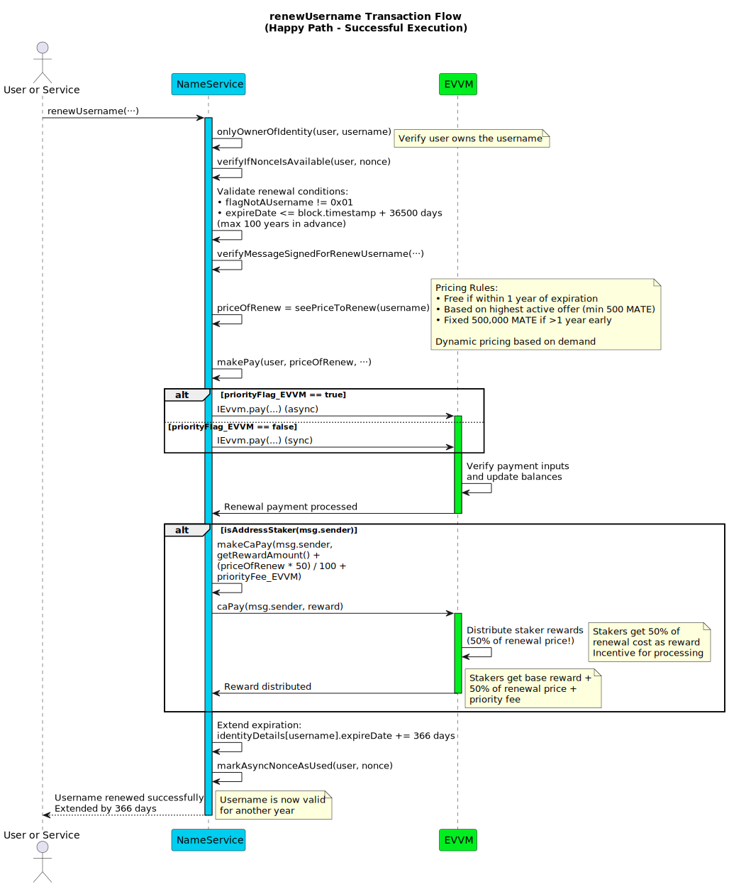
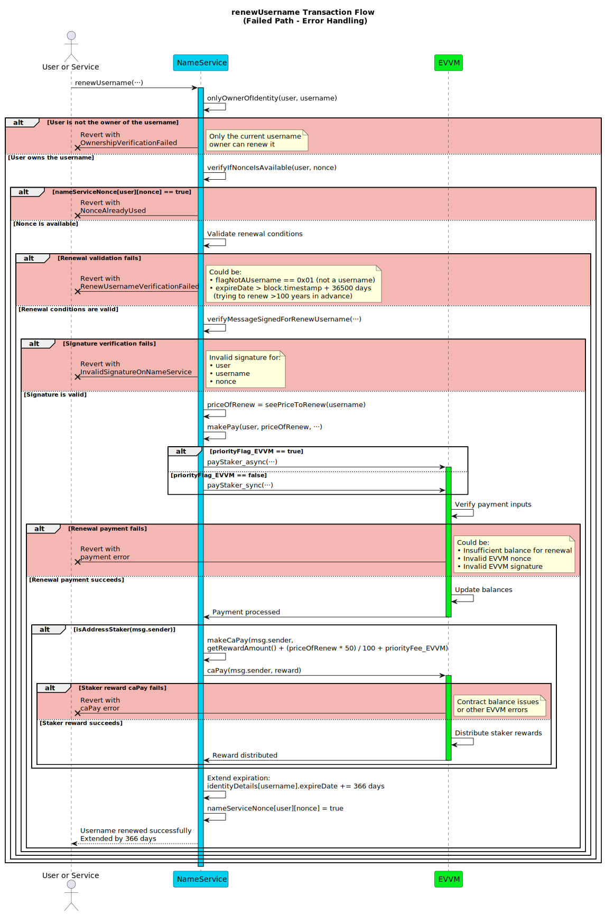

# renewUsername

**Function Type**: `public`
**Function Signature**: `renewUsername(address,string,uint256,bytes,uint256,uint256,bool,bytes)`
**Function Selector**: `0xf1747483`

Allows the current owner (`user`) of a registered username (`username`) to extend its expiration date by one year. The cost of renewal varies based on when the renewal occurs relative to the current expiration date and involves a payment in principal tokens facilitated via the EVVM contract.

## Parameters

| Parameter Name      | Type      | Description                                                                |
| ------------------- | --------- | -------------------------------------------------------------------------- |
| `user`              | `address` | The address of the **current owner** of the `username` who is renewing it. |
| `username`          | `string`  | The username whose registration is being renewed.                          |
| `nonce`             | `uint256` | The nonce value for the NameService signature.                             |
| `signature`         | `bytes`   | The NameService renew username signature.                                  |
| `priorityFee_EVVM`  | `uint256` | The priority fee amount for EVVM payment.                                  |
| `nonce_EVVM`        | `uint256` | The nonce value for the EVVM payment signature.                            |
| `priorityFlag_EVVM` | `bool`    | True for async payment, false for sync payment.                            |
| `signature_EVVM`    | `bytes`   | The EVVM payment signature.                                                |

:::note Signature Links & EVVM Payment

- The EVVM payment signature (`signature_EVVM`) is used to pay for the renewal cost and priority fees, following the [Single Payment Signature Structure](../../../05-SignatureStructures/01-EVVM/01-SinglePaymentSignatureStructure.md).
- The NameService renew username signature (`signature`) must be generated by the **current owner (`user`)** and follows the [Renew Username Signature Structure](../../../05-SignatureStructures/02-NameService/06-renewUsernameStructure.md).
- The renewal amount is calculated dynamically based on the username's current state and market demand.

:::

## Execution Methods

This function can be executed by any address.

## Workflow

Failure at validation steps typically reverts the transaction.

1. **Username Owner Verification**: Checks if the provided `_user` address is the registered owner of the `_username` (e.g., using an internal ownership check like `onlyAdminOfIdentity`). Reverts if `_user` is not the owner.
2. **NameService Nonce Verification**: Checks if the provided `_nonce` is unused for the `_user` using the `verifyIfNonceIsAvailable` modifier. Reverts if the nonce is already used.
3. **Identity Verification**: Checks if the identity exists and is a valid username (e.g., `identityDetails[_username].flagNotAUsername` indicates it's a valid username type). Reverts if the identity doesn't exist or isn't a valid username.
4. **Signature Verification**: Validates the `_signature` provided by `_user` (the owner) against the reconstructed message hash using `verifyMessageSignedForRenewUsername`. Reverts if the signature is invalid according to the [Renew Username Signature Structure](../../../05-SignatureStructures/02-NameService/06-renewUsernameStructure.md).
5. **Date Verification**: Checks if this calculated date exceeds the maximum allowed registration term (e.g., 100 years from the current block timestamp). Reverts if the renewal would extend the registration beyond this limit.
6. **Price Calculation**: Calls the `seePriceToRenew(_username)` function (or equivalent internal logic) to determine the cost (`renewalFee`) in MATE required to renew the `_username` for 366 days.
7. **EVVM Payment Execution**: The payment is executed using the `makePay` function.
8. **Reward Distribution (to Executor)**: Checks if the executor (`msg.sender`) is an sMATE staker (e.g., using `isMateStaker(msg.sender)`). If `msg.sender` is a staker:
   - Calls an internal helper function (e.g., `_giveMateReward` or `makeCaPay`) to distribute rewards in principal tokens directly to `msg.sender`.
   - The rewards typically include:
     - A base MATE reward (e.g., 1 \* `seeMateReward()` value obtained from the EVVM contract).
     - The full `_priorityFeeForFisher` amount, if it was greater than zero and successfully paid in Step 7.
     - A percentage share (e.g., 50%) of the `renewalFee` that was successfully paid in Step 7.
   - _(The remaining portion of the `renewalFee` is typically retained by the service)._
9. **Username Renewal**: Updates the stored expiration date for the username by adding one year's duration (specifically, 366 days' worth of seconds) to the current `identityDetails[_username].expireDate`.
10. **Nonce Management**: Marks the NameService `_nonce` (provided as input parameter) as used for the `_user` address within the `mateNameServiceNonce` mapping to prevent replay of this specific accept action.

