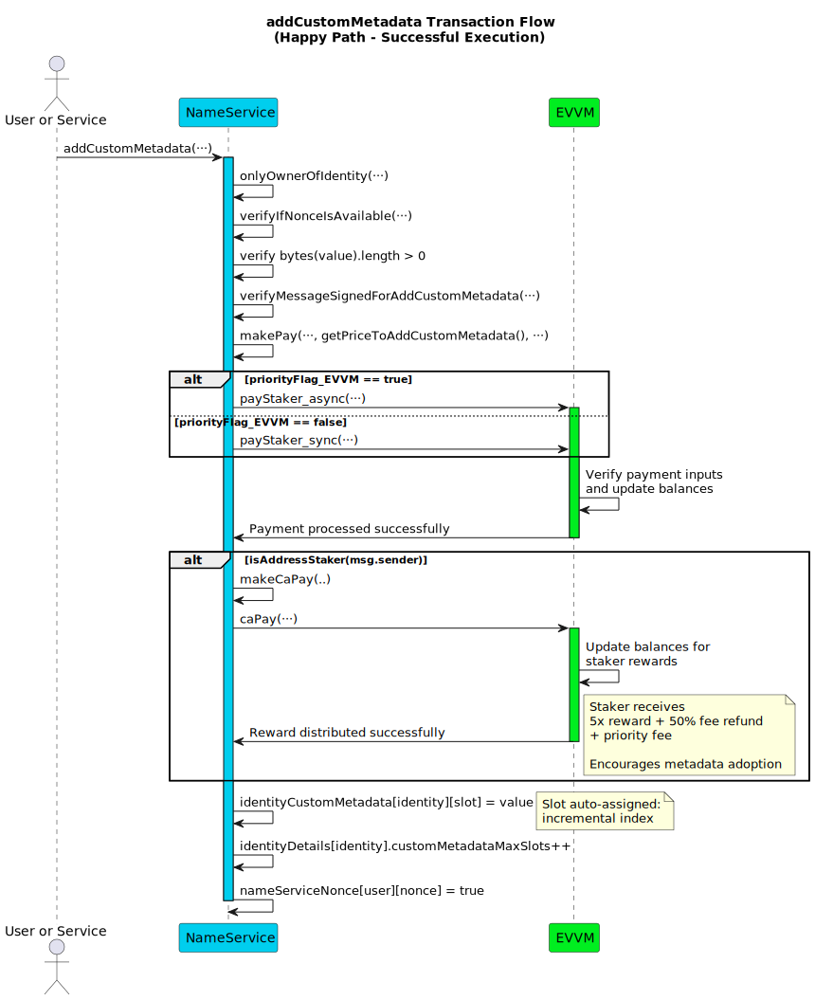
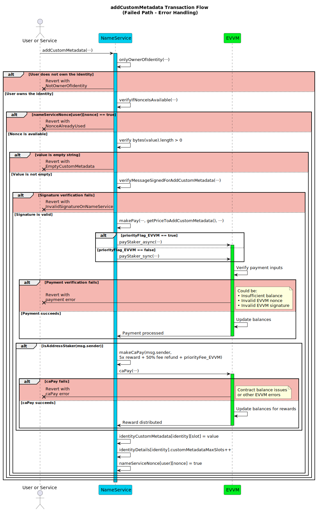

# Add Custom Metadata Function

This section details the `addCustomMetadata` function within the Name Service service. This function allows the current owner (`user`) of a registered identity (`identity`, typically a username) to associate a custom string value (`value`) with their identity.

To add custom metadata, the identity owner must authorize the action with a signature and pay a fee (10 times the current reward amount, determined by `getPriceToAddCustomMetadata()`) via the EVVM contract. An optional priority fee can also be paid to the executor. This function can be executed by any address.

**Function Type**: `public`  
**Function Signature**: `addCustomMetadata(address,string,string,uint256,bytes,uint256,uint256,bool,bytes)`  
**Function Selector**: `0xe6efeffa`

## Parameters

| Parameter Name          | Type      | Description                                                                                                                                     |
| ----------------------- | --------- | ----------------------------------------------------------------------------------------------------------------------------------------------- |
| `user`                 | `address` | The address of the **current owner** of the `identity` who is adding the metadata.                                                             |
| `identity`             | `string`  | The registered identity (e.g., username) to which the custom metadata will be added/associated.                                                 |
| `value`                | `string`  | The custom metadata value (as a string) to be stored. Must not be empty. See "Recommended Metadata Value Format" below for suggested structure. |
| `nonce`                | `uint256` | The **owner's (`user`)** nonce specific to the Name Service contract (`nameServiceNonce`) for this `addCustomMetadata` action's replay protection.  |
| `signature`            | `bytes`   | The EIP-191 signature **from the owner (`user`)** authorizing _this add metadata action_                                                       |
| `priorityFee_EVVM` | `uint256` | Optional fee (in principal tokens) paid **by the owner (`user`)** to the `msg.sender` (executor) via the EVVM contract for prioritized processing.  |
| `nonce_EVVM`           | `uint256` | **Required**. The **owner's (`user`)** nonce for the EVVM payment call used to pay the Metadata Fee + Priority Fee.                    |
| `priorityFlag_EVVM`        | `bool`    | **Required**. Priority flag (sync/async) for the EVVM payment call paying the fees.                                                     |
| `signature_EVVM`       | `bytes`   | **Required**. The **owner's (`user`)** signature authorizing the EVVM payment call paying the Metadata Fee + Priority Fee.             |

:::note Signature Links & EVVM Payment

- The EVVM payment signature (`signature_EVVM`) covers the **total** amount (calculated Metadata Fee + `priorityFee_EVVM`) and is paid **by the identity owner (`user`)**. It uses the [Single Payment Signature Structure](../../../05-SignatureStructures/01-EVVM/01-SinglePaymentSignatureStructure.md). Since a metadata fee is always required, these EVVM parameters are **mandatory**.
- The Name Service add custom metadata signature (`signature`) must be generated by the **current owner (`user`)** and follows the [Add Custom Metadata Signature Structure](../../../05-SignatureStructures/02-NameService/07-addCustomMetadataStructure.md).
- The metadata fee is calculated dynamically as **10 times the current EVVM reward amount** via `getPriceToAddCustomMetadata()`.

:::

## Metadata Pricing

The cost to add custom metadata is calculated dynamically based on the current EVVM reward amount:

**Metadata Fee** = `10 * getRewardAmount()`

This ensures the pricing scales with the network's current reward structure and maintains consistency with other protocol fees.

## Metadata Storage Mechanism

Custom metadata is stored associated with an identity. The system allows flexibility in the format of the `value` string. However, a recommended structure exists to promote interoperability and standardized parsing.

## Recommended Metadata Value Format

While not enforced on-chain, adhering to this format for the `value` string is highly recommended:

`[schema]:[subschema]>[value]`

- **Separators**:
  - `:` separates the `schema` and `subschema`.
  - `>` separates the schema/subschema prefix from the actual `value` data.
- **Schema**: A category identifier, preferably based on standard vocabularies like [Schema.org](https://schema.org/docs/schemas.html) (e.g., `email`, `memberOf`, `url`).
- **Subschema**: Provides additional context within the main schema (optional, e.g., `dev`, `work`, `personal`).
- **Padding**: If `schema` or `subschema` has fewer than 5 characters, it **should** be right-padded with spaces to exactly 5 characters. This aids off-chain parsing.
- **Social Media**: Use `schema = "socialMedia"` and `subschema = <network_name>` (e.g., `x`, `linkedin`, `github` - padded if needed). The `value` is the username/handle on that network.

**Examples:**

- `memberOf:>EVVM` _(Schema: memberOf, Value: EVVM)_
- `socialMedia:x>jistro` _(Schema: socialMedia, Subschema: x, Value: jistro)_
- `email:dev>jistro[at]evvm.org` _(Schema: email, Subschema: dev, Value: jistro[at]evvm.org)_
- `email:callme>contact[at]jistro.xyz` _(Schema: email, Subschema: callme, Value: contact[at]jistro.xyz)_

### Workflow

Failure at validation steps typically reverts the transaction. The steps execute **in the specified order**.

1.  **Identity Ownership Verification**: Checks if the provided `identity` is owned by the `user`. Reverts if not.
2.  **Name Service Nonce Verification**: Checks if the provided `nonce` is unused for the `user` using the `verifyIfNonceIsAvailable` modifier. Reverts if used.
3.  **Custom Metadata Length Validation**: Checks that the provided `value` string has a length greater than 0. Reverts if the value is empty.
4.  **Add Custom Metadata Signature Validation**: Verifies the `signature` provided by `user` (authorizing this Name Service action) using `verifyMessageSignedForAddCustomMetadata`. Reverts if invalid according to the [Add Custom Metadata Signature Structure](../../../05-SignatureStructures/02-NameService/07-addCustomMetadataStructure.md).
5.  **Payment execution**: Calls `makePay` to transfer the payment using the `getPriceToAddCustomMetadata` function and `priorityFee_EVVM` of principal tokens from `user` to the service via the EVVM contract. Reverts if the payment fails.
6.  **Reward Distribution (to Executor)**: If the executor (`msg.sender`) is an sMATE staker, calls an internal helper function (`makeCaPay`) to distribute rewards in principal tokens directly to `msg.sender`. The rewards consist of:
    - 5 times the base reward amount (`5 * Evvm(evvmAddress.current).getRewardAmount()`).
    - 50% of the metadata fee (`(getPriceToAddCustomMetadata() * 50) / 100`).
    - The full `priorityFee_EVVM`, if it was greater than zero and successfully paid in Step 5.
7.  **Custom Metadata Storage**: Stores the provided `value` string associated with the `identity`. This is done by adding the `value` to the mapping `identityCustomMetadata[identity][slot] = value` where slot is the current `identityDetails[identity].customMetadataMaxSlots` value.
8.  **Slot Counter Update**: Increments the counter (`identityDetails[identity].customMetadataMaxSlots++`) that tracks the number of metadata entries for that identity.
9.  **Nonce Management**: Marks the Name Service `nonce` (provided as an input parameter for this transaction) as used for the `user` address within the `nameServiceNonce` mapping.

