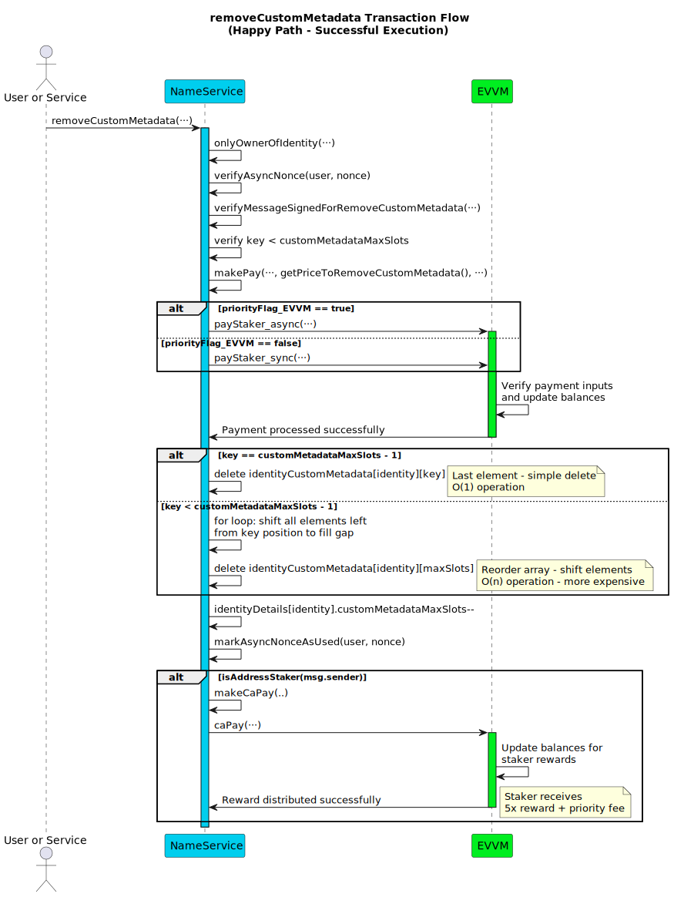
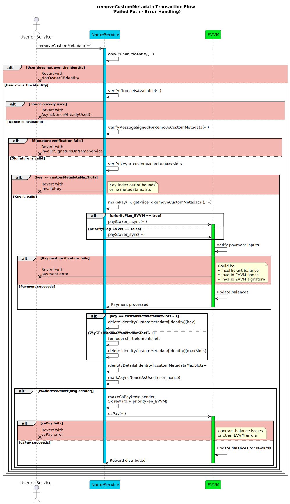

# Remove Custom Metadata Function

This section details the `removeCustomMetadata` function within the name service. This function allows the current owner (`user`) of a registered identity (`identity`, typically a username) to remove a specific custom metadata entry identified by its index (`key`).

To remove custom metadata, the identity owner must authorize the action with a signature and pay a fee (10 times the current reward amount, determined by `getPriceToRemoveCustomMetadata()`) via the EVVM contract. An optional priority fee can also be paid to the executor. This function can be executed by any address.

**Function Type**: `public`  
**Function Signature**: `removeCustomMetadata(address,string,uint256,uint256,bytes,uint256,uint256,bool,bytes)`  
**Function Selector**: `0x8001a999`

## Parameters

| Parameter Name          | Type      | Description                                                                                                                                                        |
| ----------------------- | --------- | ------------------------------------------------------------------------------------------------------------------------------------------------------------------ |
| `user`                 | `address` | The address of the **current owner** of the `identity` who is removing the metadata.                                                                              |
| `identity`             | `string`  | The registered identity (e.g., username) from which the custom metadata will be removed.                                                                           |
| `key`                  | `uint256` | The index (zero-based) of the specific custom metadata entry to be removed from the identity's list.                                                               |
| `nonce`                | `uint256` | The **owner's (`user`)** nonce specific to the Name Service contract (`nameServiceNonce`) for this `removeCustomMetadata` action's replay protection.                  |
| `signature`            | `bytes`   | The EIP-191 signature **from the owner (`user`)** authorizing _this remove metadata action_.                              |
| `priorityFee_EVVM` | `uint256` | Optional fee (in principal tokens) paid **by the owner (`user`)** to the `msg.sender` (executor) via the EVVM contract for prioritized processing of this transaction. |
| `nonce_EVVM`           | `uint256` | **Required**. The **owner's (`user`)** nonce for the EVVM payment call used to pay the Metadata Removal Fee + Priority Fee.                               |
| `priorityFlag_EVVM`        | `bool`    | **Required**. Priority flag (sync/async) for the EVVM payment call paying the fees.                                                                        |
| `signature_EVVM`       | `bytes`   | **Required**. The **owner's (`user`)** signature authorizing the EVVM payment call paying the Metadata Removal Fee + Priority Fee.                        |

:::note Signature Links & EVVM Payment

- The EVVM payment signature (`signature_EVVM`) covers the **total** amount (calculated Metadata Fee + `priorityFee_EVVM`) and is paid **by the identity owner (`user`)**. It uses the [Single Payment Signature Structure](../../../05-SignatureStructures/01-EVVM/01-SinglePaymentSignatureStructure.md). Since a metadata fee is always required, these EVVM parameters are **mandatory**.
- The Name Service remove custom metadata signature (`signature`) must be generated by the **current owner (`user`)** and follows the [Remove Custom Metadata Signature Structure](../../../05-SignatureStructures/02-NameService/08-removeCustomMetadataStructure.md).
- The metadata fee is calculated dynamically as **10 times the current EVVM reward amount** via `getPriceToRemoveCustomMetadata()`.

:::

## Metadata Pricing

The cost to remove custom metadata is calculated dynamically based on the current EVVM reward amount:

**Metadata Removal Fee** = `10 * getRewardAmount()`

This ensures the pricing scales with the network's current reward structure and maintains consistency with other protocol fees.

### Workflow

Failure at validation steps typically reverts the transaction. The steps execute **in the specified order**.

1.  **Identity Ownership Verification**: Checks if the provided `user` address is the registered owner of the `identity`. Reverts if `user` is not the owner.
2.  **Name Service Nonce Verification**: Calls internal `verifyAsyncNonce(user, nonce)` which reverts with `AsyncNonceAlreadyUsed()` if the nonce was already used.
3.  **Remove Custom Metadata Signature Validation**: Verifies the `signature` provided by `user` (the owner) against the reconstructed message hash using `verifyMessageSignedForRemoveCustomMetadata`. Reverts if the signature is invalid according to the [Remove Custom Metadata Signature Structure](../../../05-SignatureStructures/02-NameService/08-removeCustomMetadataStructure.md).
4.  **Custom Metadata Index Validation**: Checks that the provided `key` (index) is valid, meaning it is less than the current number of metadata entries for the `identity` (`key < identityDetails[identity].customMetadataMaxSlots`). Reverts if the index is out of bounds.
5.  **Payment execution**: Calls `makePay` to transfer the payment using the `getPriceToRemoveCustomMetadata()` function and `priorityFee_EVVM` of principal tokens from `user` to the service via the EVVM contract. Reverts if the payment fails.
6.  **Custom Metadata Removal**: Removes the metadata entry at the specified `key` index for the `identity`. The removal process involves two scenarios:
    - **If `key == customMetadataMaxSlots` (Last element):** Directly deletes the metadata entry at `identityCustomMetadata[identity][key]`.
    - **If `key < customMetadataMaxSlots` (Not the last element):** 
      - Iterates from `i = key` up to `customMetadataMaxSlots - 1`.
      - In each iteration, copies the metadata entry from index `i + 1` to index `i` (`identityCustomMetadata[identity][i] = identityCustomMetadata[identity][i + 1]`).
      - Deletes the entry at the last occupied index (`identityCustomMetadata[identity][customMetadataMaxSlots]`) to clear the duplicated data.
7.  **Decrement Count**: Decreases the metadata count: `identityDetails[identity].customMetadataMaxSlots--` to reflect the removal.
8.  **Nonce Management**: Calls internal `markAsyncNonceAsUsed(user, nonce)` to mark the provided `nonce` as used and prevent replays.
9.  **Reward Distribution (to Executor)**: If the executor (`msg.sender`) is an sMATE staker, calls an internal helper function (`makeCaPay`) to distribute rewards in principal tokens directly to `msg.sender`. The rewards consist of:
    - 5 times the base reward amount (`5 * Evvm(evvmAddress.current).getRewardAmount()`).
    - The full `priorityFee_EVVM`, if it was greater than zero and successfully paid in Step 5.

