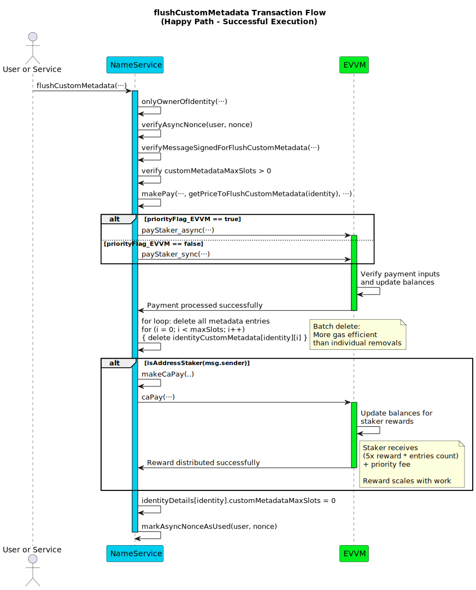
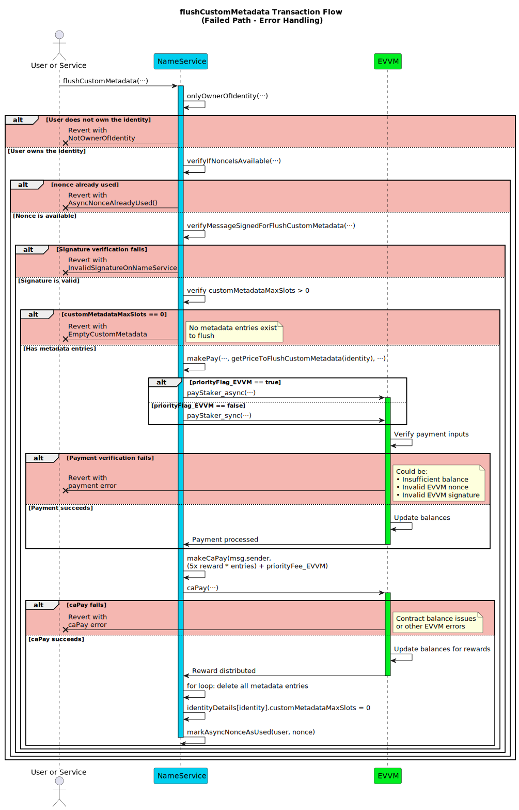

# Flush Custom Metadata Function

This section details the `flushCustomMetadata` function within the Name Service. This function allows the current owner (`user`) of a registered identity (`identity`, typically a username) to remove **all** custom metadata entries associated with that identity in a single transaction.

To flush all custom metadata, the identity owner must authorize the action with their signature and pay a fee via the EVVM contract. This fee is calculated dynamically as 10 times the current reward amount per metadata entry via `getPriceToFlushCustomMetadata(identity)`. An optional priority fee can also be paid to the executor. This function can be executed by any address.

**Function Type**: `public`  
**Function Signature**: `flushCustomMetadata(address,string,uint256,bytes,uint256,uint256,bool,bytes)`  
**Function Selector**: `0x3e7899a1`

## Parameters

| Parameter Name          | Type      | Description                                                                                                                                                                                  |
| ----------------------- |-----------|----------------------------------------------------------------------------------------------------------------------------------------------------------------------------------------------|
| `user`                 | `address` | The address of the **current owner** of the `identity` who is authorizing the flush.                                                                                                        |
| `identity`             | `string`  | The registered identity (e.g., username) from which all custom metadata entries will be flushed.                                                                                             |
| `nonce`                | `uint256` | The **owner's (`user`)** nonce specific to the NameService contract (`nameServiceNonce`) for this `flushCustomMetadata` action's replay protection.                                             |
| `signature`            | `bytes`   | The EIP-191 signature **from the owner (`user`)** authorizing *this flush all metadata action*.                                              |
| `priorityFee_EVVM` | `uint256` | Optional fee (in principal tokens) paid **by the owner (`user`)** to the `msg.sender` (executor) via the EVVM contract for prioritized processing of this transaction.                           |
| `nonce_EVVM`           | `uint256` | **Required**. The **owner's (`user`)** nonce for the EVVM payment call used to pay the total calculated Flush Fee + Priority Fee.                                               |
| `priorityFlag_EVVM`        | `bool`    | **Required**. Priority flag (sync/async) for the EVVM payment call paying the fees.                                                                                                 |
| `signature_EVVM`       | `bytes`   | **Required**. The **owner's (`user`)** signature authorizing the EVVM payment call.                        |

:::note Signature Links & EVVM Payment

- The EVVM payment signature (`signature_EVVM`) covers the **total** amount (calculated Flush Fee + `priorityFee_EVVM`) and is paid **by the identity owner (`user`)**. It uses the [Single Payment Signature Structure](../../../05-SignatureStructures/01-EVVM/01-SinglePaymentSignatureStructure.md). Since a flush fee is always required, these EVVM parameters are **mandatory**.
- The NameService flush custom metadata signature (`signature`) must be generated by the **current owner (`user`)** and follows the [Flush Custom Metadata Signature Structure](../../../05-SignatureStructures/02-NameService/09-flushCustomMetadataStructure.md).
- The flush fee is calculated dynamically based on **10 times the current EVVM reward amount for each metadata entry** (`getPriceToFlushCustomMetadata(identity)`).

:::

## Metadata Pricing

The cost to flush all custom metadata is calculated dynamically based on the current EVVM reward amount and the number of metadata entries:

**Flush Fee** = `(10 * getRewardAmount()) * customMetadataMaxSlots`

This ensures the pricing scales with both the network's current reward structure and the amount of work required to flush all entries.

### Workflow

Failure at validation steps typically reverts the transaction. The steps execute **in the specified order**.

1.  **Identity Ownership Verification**: Checks if the provided `user` address is the registered owner of the `identity`. Reverts if `user` is not the owner.
2.  **NameService Nonce Verification**: Calls internal `verifyAsyncNonce(user, nonce)` which reverts with `AsyncNonceAlreadyUsed()` if the nonce was already used.
3.  **Flush Custom Metadata Signature Validation**: Verifies the `signature` provided by `user` (the owner) against the reconstructed message hash using `verifyMessageSignedForFlushCustomMetadata`. Reverts if the signature is invalid according to the [Flush Custom Metadata Signature Structure](../../../05-SignatureStructures/02-NameService/09-flushCustomMetadataStructure.md).
4.  **Empty Metadata Validation**: Checks that the identity has at least one metadata entry (`identityDetails[identity].customMetadataMaxSlots > 0`). Reverts if there are no metadata entries to flush.
5.  **Payment Execution**: Calls `makePay` to transfer the payment using `getPriceToFlushCustomMetadata(identity)` and `priorityFee_EVVM` of principal tokens from `user` to the service via the EVVM contract. Reverts if the payment fails.
6.  **Custom Metadata Removal (Flush)**: Iterates through all metadata entries and deletes them:
    - Loops from `i = 0` to `customMetadataMaxSlots - 1`
    - Deletes each entry: `delete identityCustomMetadata[identity][i]`
7.  **Reward Distribution (to Executor)**: If the executor (`msg.sender`) is an sMATE staker, calls an internal helper function (`makeCaPay`) to distribute rewards in principal tokens directly to `msg.sender`. The rewards consist of:
    - 5 times the base reward amount **multiplied by the number of metadata entries** (`(5 * getRewardAmount()) * customMetadataMaxSlots`).
    - The full `priorityFee_EVVM`, if it was greater than zero and successfully paid in Step 5.
8.  **Reset Metadata Counter**: Sets `identityDetails[identity].customMetadataMaxSlots = 0` to reflect that all metadata has been removed.
9.  **Nonce Management**: Calls internal `markAsyncNonceAsUsed(user, nonce)` to mark the provided `nonce` as used and prevent replays.

