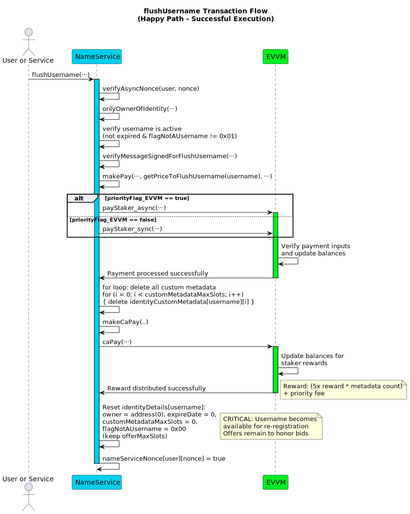
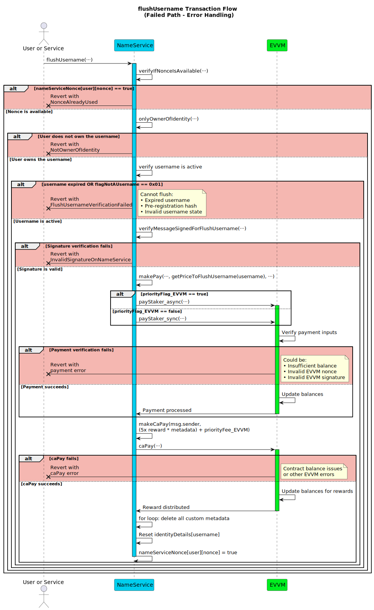

# Flush Username Function

This section details the `flushUsername` function within the Name Service. This function allows the current owner (`user`) of a registered identity (`username`, typically a username) to **permanently delete the username registration and all of its associated data**. This is an irreversible action that makes the username available for registration again by others.

To flush a username, the owner must authorize the action with their signature and pay a fee via the EVVM contract (determined by `getPriceToFlushUsername(username)`). An optional priority fee can also be paid to the executor. This function can be executed by any address.

**Function Type**: `public`  
**Function Signature**: `flushUsername(address,string,uint256,bytes,uint256,uint256,bool,bytes)`  
**Function Selector**: `0xd22c816c`

## Parameters

| Parameter Name          | Type      | Description                                                                                                                                                                          |
| ----------------------- |-----------|--------------------------------------------------------------------------------------------------------------------------------------------------------------------------------------|
| `user`                 | `address` | The address of the **current owner** of the `username` who is authorizing the permanent deletion.                                                                                   |
| `username`             | `string`  | The registered identity (e.g., username) to be permanently flushed from the system.                                                                                                  |
| `nonce`                | `uint256` | The **owner's (`user`)** nonce specific to the Name Service contract (`nameServiceNonce`) for this `flushUsername` action's replay protection.                                           |
| `signature`            | `bytes`   | The EIP-191 signature **from the owner (`user`)** authorizing *this flush username action*.                                        |
| `priorityFee_EVVM` | `uint256` | Optional fee (in principal tokens) paid **by the owner (`user`)** to the `msg.sender` (executor) via the EVVM contract for prioritized processing of this transaction.                   |
| `nonce_EVVM`           | `uint256` | **Required**. The **owner's (`user`)** nonce for the EVVM payment call used to pay the total calculated Flush Fee + Priority Fee.                                         |
| `priorityFlag_EVVM`        | `bool`    | **Required**. Priority flag (sync/async) for the EVVM payment call paying the fees.                                                                                         |
| `signature_EVVM`       | `bytes`   | **Required**. The **owner's (`user`)** signature authorizing the EVVM payment call to transfer the total calculated Flush Fee + Priority Fee.                           |

:::note Signature Links & EVVM Payment

- The EVVM payment signature (`signature_EVVM`) covers the **total** amount (calculated Flush Fee + `priorityFee_EVVM`) and is paid **by the identity owner (`user`)**. It uses the [Single Payment Signature Structure](../../../05-SignatureStructures/01-EVVM/01-SinglePaymentSignatureStructure.md). Since a flush fee is required, these EVVM parameters are **mandatory**.
- The Name Service flush username signature (`signature`) must be generated by the **current owner (`user`)** and follows the [Flush Username Signature Structure](../../../05-SignatureStructures/02-NameService/10-flushUsernameStructure.md).
- The flush fee is calculated as the sum of metadata flush cost plus a base username deletion fee via `getPriceToFlushUsername(username)`.

:::

## Username Flush Pricing

The cost to flush a username is calculated dynamically based on the current EVVM reward amount and includes both metadata removal and username deletion costs:

**Flush Fee** = `((10 * getRewardAmount()) * customMetadataMaxSlots) + getRewardAmount()`

This pricing includes:
- **Metadata removal cost**: 10x reward amount per metadata entry
- **Base username deletion fee**: 1x reward amount

### Workflow

Failure at validation steps typically reverts the transaction. The steps execute **in the specified order**.

1.  **NameService Nonce Verification**: Checks if the provided `nonce` is unused for the `user` using the `verifyIfNonceIsAvailable` modifier. Reverts if the nonce is already used.
2.  **Identity Ownership Verification**: Checks if the provided `user` address is the registered owner of the `username`. Reverts if `user` is not the owner.
3.  **Username Expiration and Type Validation**: Validates that the username has not expired and is a valid username type:
    - Checks that `block.timestamp < identityDetails[username].expireDate` (username is still active)
    - Checks that `identityDetails[username].flagNotAUsername == 0x00` (it's a username, not another type of identity)
    - Reverts with `FlushUsernameVerificationFailed` if either condition fails.
4.  **Flush Username Signature Validation**: Verifies the `signature` provided by `user` (the owner) against the reconstructed message hash using `verifyMessageSignedForFlushUsername`. Reverts if the signature is invalid according to the [Flush Username Signature Structure](../../../05-SignatureStructures/02-NameService/10-flushUsernameStructure.md).
5.  **Payment Execution**: Calls `makePay` to transfer the payment using `getPriceToFlushUsername(username)` and `priorityFee_EVVM` of principal tokens from `user` to the service via the EVVM contract. Reverts if the payment fails.
6.  **Custom Metadata Removal**: Iterates through all metadata entries and deletes them:
    - Loops from `i = 0` to `customMetadataMaxSlots - 1`
    - Deletes each entry: `delete identityCustomMetadata[username][i]`
7.  **Reward Distribution (to Executor)**: Calls an internal helper function (`makeCaPay`) to distribute rewards in principal tokens directly to `msg.sender` (the executor). The rewards consist of:
    - 5 times the base reward amount **multiplied by the number of metadata entries** (`(5 * getRewardAmount()) * customMetadataMaxSlots`).
    - The full `priorityFee_EVVM`, if it was greater than zero and successfully paid in Step 5.
8.  **Username Registration Reset**: Resets the username registration data while preserving offer slots:
    - Sets `owner` to `address(0)`
    - Sets `expireDate` to `0`
    - Sets `customMetadataMaxSlots` to `0`
    - Preserves existing `offerMaxSlots`
    - Sets `flagNotAUsername` to `0x00` (making it available for re-registration)
9.  **Nonce Management**: Marks the Name Service `nonce` as used for the `user` address within the `nameServiceNonce` mapping.

