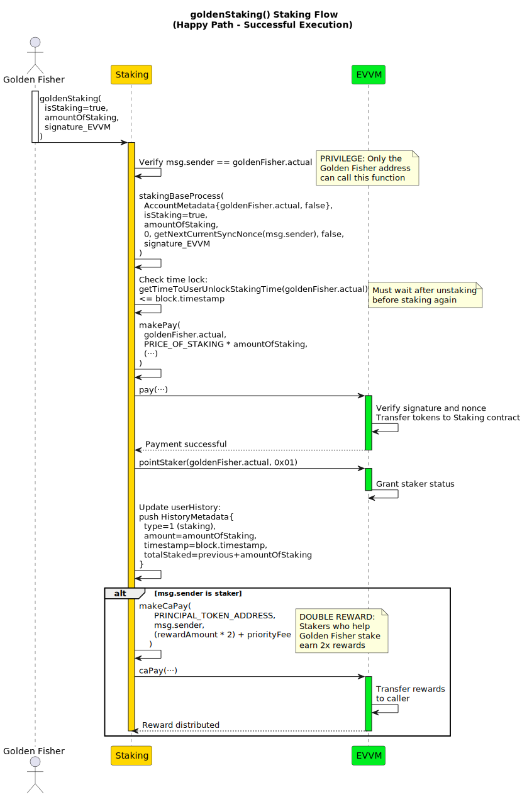
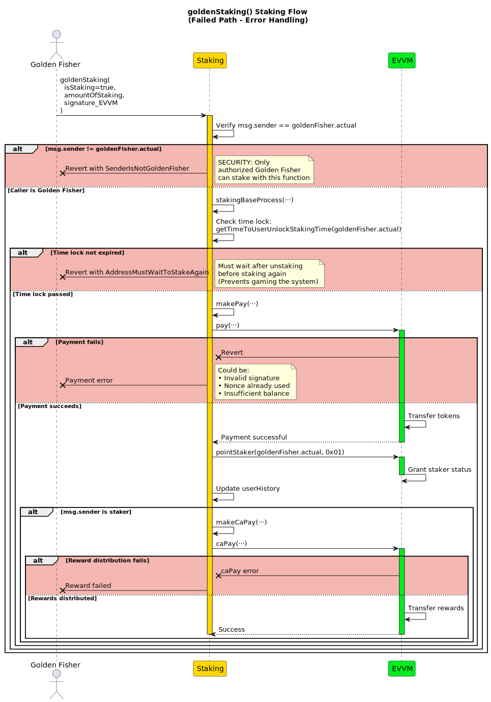
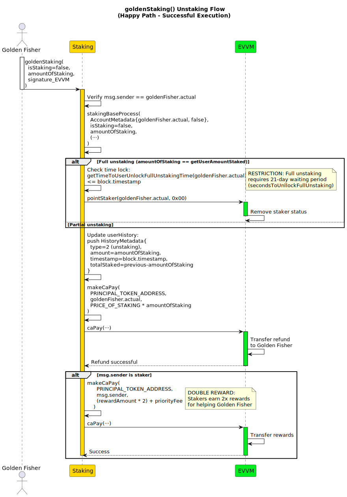
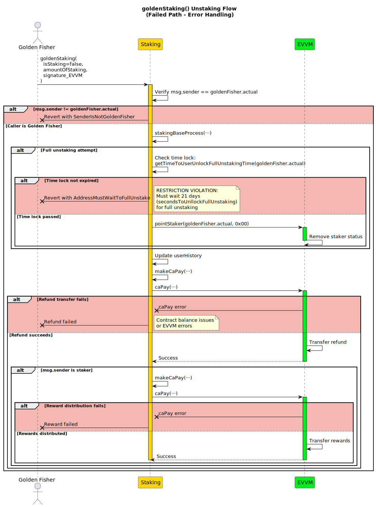

# goldenStaking

**Function Type**: `external`  
**Function Signature**: `goldenStaking(bool,uint256,bytes)`  
**Function Selector**: `0x475c31ff`

The `goldenStaking` function provides administrative control over staking operations. It is exclusively accessible to the `goldenFisher` address, allowing privileged execution of stake/unstake actions that bypass standard verification requirements. This function automatically uses the golden fisher's synchronized EVVM nonce for transactions.

## Parameters

| Parameter         | Type    | Description                               |
| ----------------- | ------- | ----------------------------------------- |
| `isStaking`       | bool    | `true` = Stake, `false` = Unstake         |
| `amountOfStaking` | uint256 | Amount of staking tokens to stake/unstake |
| `signature_EVVM`  | bytes   | EVVM authorization signature              |

:::note
The EVVM payment signature (`signature_EVVM`) follows the [Single Payment Signature Structure](../../../../05-SignatureStructures/01-EVVM/01-SinglePaymentSignatureStructure.md).
:::

## Workflow

### Staking Process

1. **Authorization Validation**: Verifies caller is the designated `goldenFisher` address
2. **Process Execution**: Calls internal `stakingBaseProcess` with:
   - Golden fisher address as both payer and staker
   - Automatic synchronous EVVM nonce retrieval
   - No priority fees (set to 0)
   - Standard staking processing flow

:::info

For detailed information about the `stakingBaseProcess` implementation, refer to the [stakingBaseProcess](../02-InternalStakingFunctions/01-stakingBaseProcess.md).

:::

### Unstaking Process

1. **Authorization Validation**: Verifies caller is the designated `goldenFisher` address
2. **Process Execution**: Calls internal `stakingBaseProcess` with:
   - Golden fisher address as both payer and staker
   - Automatic synchronous EVVM nonce retrieval
   - No priority fees (set to 0)
   - Standard unstaking processing flow

:::info

For detailed information about the `stakingBaseProcess` implementation, refer to the [stakingBaseProcess](../02-InternalStakingFunctions/01-stakingBaseProcess.md).

:::

