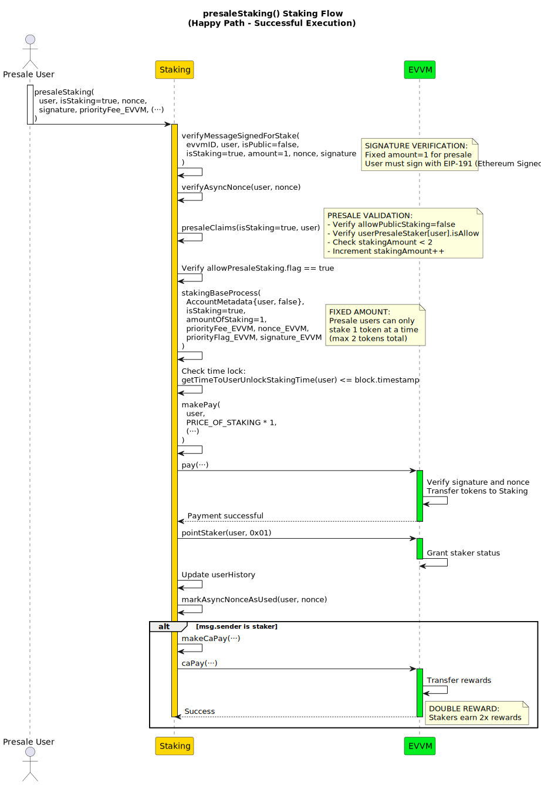
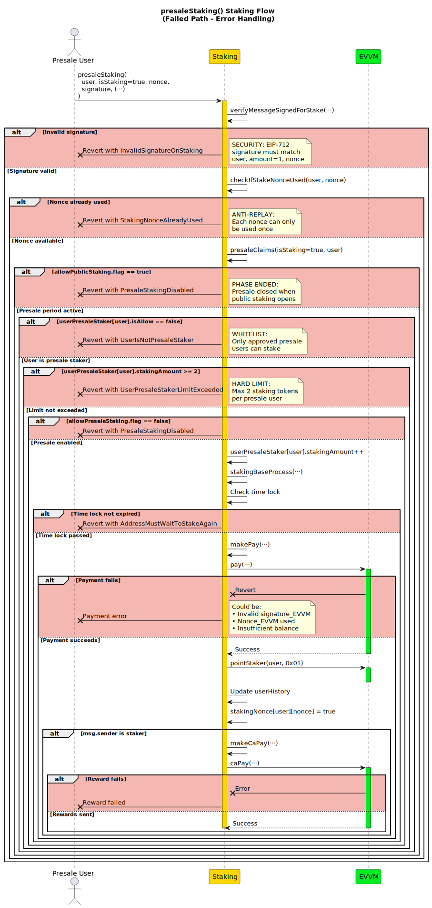
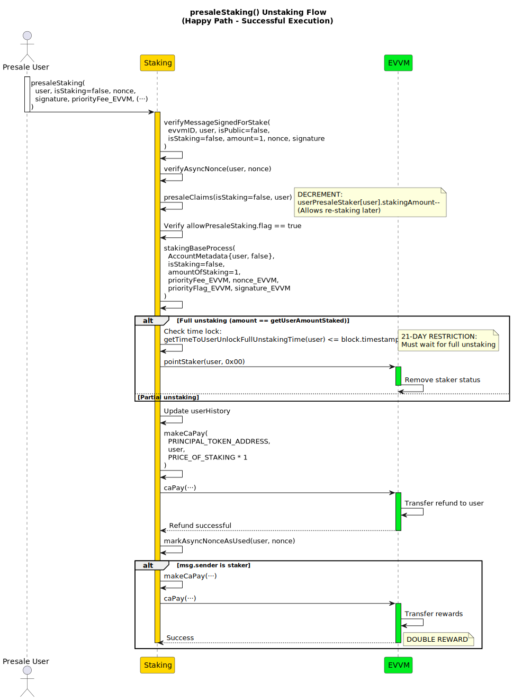
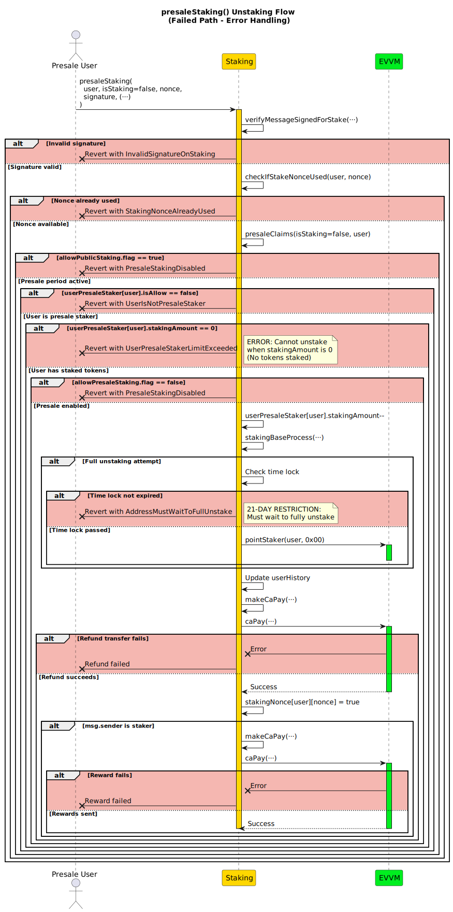

# presaleStaking

**Function Type**: `external`  
**Function Signature**: `presaleStaking(address,bool,uint256,bytes,uint256,uint256,bool,bytes)` 

The `presaleStaking` function enables presale participants to stake or unstake their MATE tokens under specific restrictions. This function ensures exclusive access for qualifying presale users while enforcing operational limits.

## Restrictions

- Fixed amount of 1 staking token per operation
- Maximum allocation of 2 staking tokens per user
- Requires active `allowPresaleStaking` flag
- Not available when `allowPublicStaking` flag is active (presale users must use `publicStaking` instead)

:::info

For all EVVM testnets `allowPublicStaking.flag` is enabled by default, all users should use the `publicStaking` function for staking and unstaking operations.

:::

## Parameters

| Parameter           | Type    | Description                                          |
| ------------------- | ------- | ---------------------------------------------------- |
| `user`              | address | Presale participant's wallet address                 |
| `isStaking`         | bool    | `true` = Stake, `false` = Unstake                    |
| `nonce`             | uint256 | Staking contract nonce for replay protection         |
| `signature`         | bytes   | User authorization signature                         |
| `priorityFee_EVVM`  | uint256 | EVVM priority fee                                    |
| `nonce_EVVM`        | uint256 | EVVM payment operation nonce                         |
| `priorityFlag_EVVM` | bool    | EVVM execution mode (`true` = async, `false` = sync) |
| `signature_EVVM`    | bytes   | EVVM payment authorization                           |

:::note

- If you want to know more about the signature structure, refer to the [Standard Staking/Unstaking Signature Structure](../../../../05-SignatureStructures/03-Staking/01-StandardStakingStructure.md).
- The EVVM payment signature (`signature_EVVM`) follows the [Single Payment Signature Structure](../../../../05-SignatureStructures/01-EVVM/01-SinglePaymentSignatureStructure.md).
  :::

## Workflow

The function supports two execution paths:

- **Fisher-Mediated**: A designated fisher captures the transaction from the fishing spot and submits it to the contract
- **Direct User Submission**: The user directly submits the transaction to the contract

## Staking Process

1. **Signature Verification**: Validates the authenticity of the user signature
2. **Nonce Validation**: Confirms the contract nonce is valid and unused
3. **Presale Claims Processing**: Calls `presaleClaims()` to verify presale participation and enforce 2-token limit
4. **Presale Staking Status**: Verifies `allowPresaleStaking.flag` is enabled
5. **Process Execution**: Calls the internal `stakingBaseProcess` function with:
   - User address and IsAService=false in AccountMetadata
   - Fixed amount of 1 staking token
   - Standard EVVM payment processing
   - Historical record updates and reward distribution
6. **Nonce Update**: Marks the staking nonce as used to prevent replay attacks

:::info

For detailed information about the `stakingBaseProcess` function, refer to the [stakingBaseProcess](../02-InternalStakingFunctions/02-stakingBaseProcess.md).

:::

## Unstaking Process

1. **Signature Verification**: Validates the authenticity of the user signature
2. **Nonce Validation**: Confirms the contract nonce is valid and unused
3. **Presale Claims Processing**: Calls `presaleClaims()` to verify presale participation and validate unstaking eligibility
4. **Presale Staking Status**: Verifies `allowPresaleStaking.flag` is enabled
5. **Process Execution**: Calls the internal `stakingBaseProcess` function with:
   - User address and IsAService=false in AccountMetadata
   - Fixed amount of 1 staking token
   - Standard EVVM payment processing
   - Historical record updates and reward distribution
6. **Nonce Update**: Marks the staking nonce as used to prevent replay attacks

:::info

For detailed information about the `stakingBaseProcess` function, refer to the [stakingBaseProcess](../02-InternalStakingFunctions/02-stakingBaseProcess.md).

:::

