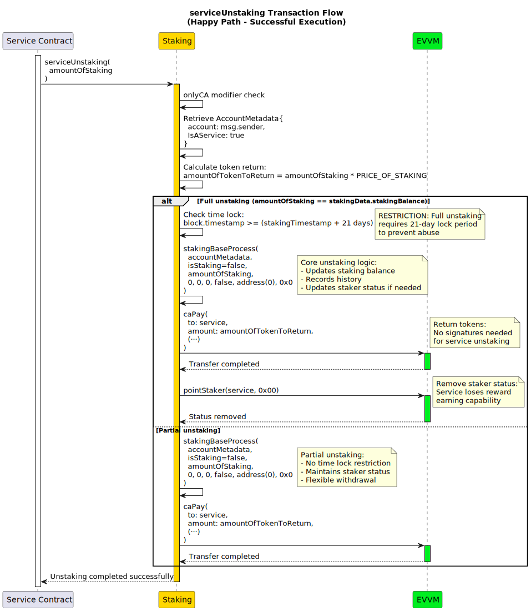
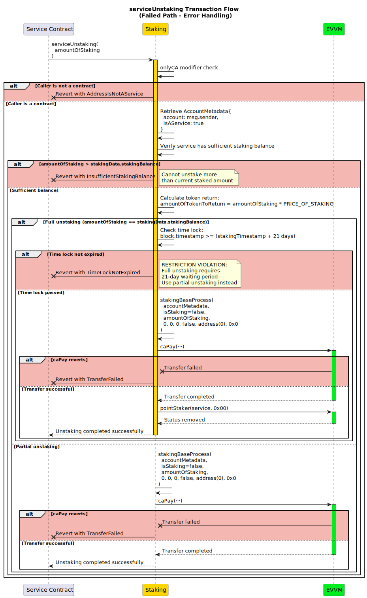

# serviceUnstaking

**Function Type**: `external`  
**Function Signature**: `serviceUnstaking(uint256)`  
**Access Control**: `onlyCA` (Contract Accounts Only)

The `serviceUnstaking` function allows smart contracts (services) to unstake their staking tokens directly. This is a simplified unstaking process for services that doesn't require signatures or complex payment processing.

## Parameters

| Parameter | Type | Description |
|-----------|------|-------------|
| `amountOfStaking` | uint256 | Amount of staking tokens to unstake |

## Workflow

### Unstaking Process

1. **Access Control**: Verifies caller is a contract account using `onlyCA` modifier
2. **Direct Processing**: Calls `stakingBaseProcess` with service-specific parameters:
   - Service address and IsAService=true in AccountMetadata
   - Unstaking operation (isStaking=false) 
   - Specified unstaking amount
   - Zero values for all EVVM parameters

### Service Advantages

Unlike user unstaking, service unstaking:
- **No Signatures Required**: Services don't need to provide authorization signatures
- **No Priority Fees**: No additional payment processing needed
- **Simplified Flow**: Direct call to core staking logic
- **Contract-Only**: Restricted to smart contract accounts for security

## Token Return Process

When unstaking is successful:

1. **Token Calculation**: Returns `amountOfStaking * PRICE_OF_STAKING` Principal Tokens
2. **Direct Transfer**: Tokens transferred directly to the service address via `makeCaPay()`
3. **Status Update**: If full unstaking, removes staker status via EVVM contract
4. **History Recording**: Updates service's staking history with unstaking transaction

## Time Lock Restrictions

Service unstaking is subject to the same time lock restrictions as user unstaking:

### Re-staking Cooldown
- Must wait after complete unstaking before staking again
- Controlled by `secondsToUnlockStaking.actual`

### Full Unstaking Cooldown  
- Must wait the full period (default 21 days) for complete unstaking
- Controlled by `secondsToUnlockFullUnstaking.actual`
- Applies when unstaking all remaining tokens

## Error Conditions

The function may revert with:

| Error | Condition |
|-------|-----------|
| `AddressIsNotAService()` | Caller is not a contract account (EOA attempted access) |
| `AddressMustWaitToFullUnstake()` | Full unstaking cooldown period not met |
| `InsufficientStakingBalance()` | Attempting to unstake more than available |

## Integration Points

### With stakingBaseProcess
- Uses core unstaking logic with service-specific configuration
- IsAService=true enables service-specific processing paths
- Simplified parameter set (no signatures or payments)

### With EVVM Contract
- Token returns processed through EVVM's `caPay()` function
- Staker status updates coordinated with EVVM contract
- Balance queries for validation

## Example Usage

```solidity
// Service unstaking 3 tokens
contract MyService {
    function unstakeTokens() external {
        // Unstake 3 staking tokens
        stakingContract.serviceUnstaking(3);
        
        // Service will receive: 3 * PRICE_OF_STAKING Principal Tokens
        // Tokens appear in service's EVVM balance
    }
    
    function unstakeAll() external {
        // Check current staked amount
        uint256 stakedAmount = stakingContract.getUserAmountStaked(address(this));
        
        // Unstake everything (subject to full unstaking cooldown)
        stakingContract.serviceUnstaking(stakedAmount);
    }
}
```

## Comparison with User Unstaking

| Aspect | Service Unstaking | User Unstaking |
|--------|------------------|----------------|
| **Access Control** | Contract accounts only | Any address |
| **Signatures** | None required | EIP-191 signature required |
| **Payment Processing** | None | Optional priority fees |
| **Nonce Management** | None | Nonce validation required |
| **Time Locks** | Same restrictions | Same restrictions |

:::info

For detailed information about the core unstaking logic and time lock calculations, refer to the [stakingBaseProcess](../../02-InternalStakingFunctions/01-stakingBaseProcess.md).

:::

:::tip

Services can check their current staked amount using `getUserAmountStaked(address(this))` before calling this function to ensure they don't attempt to unstake more than available.

:::


