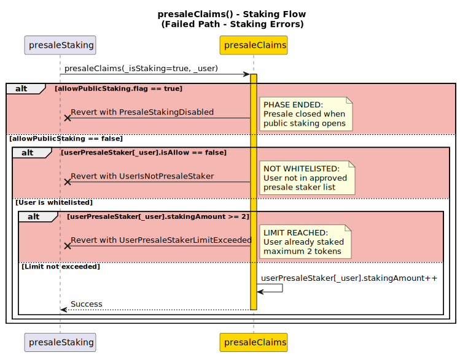
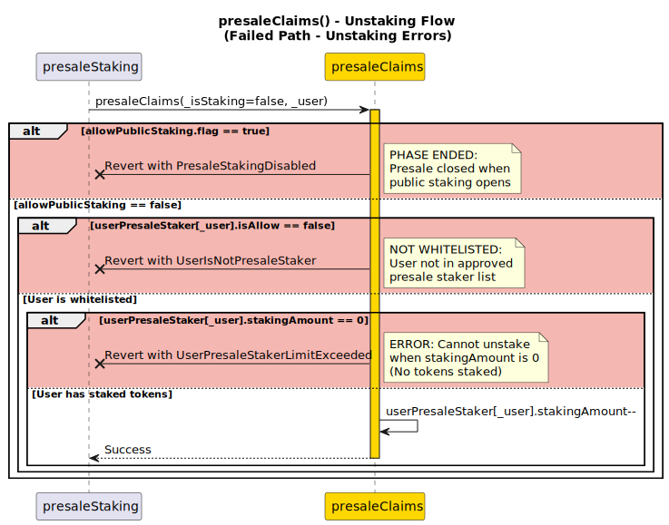

# presaleClaims

**Function Type**: `internal`

The `presaleClaims` function manages presale staking limits and permissions by enforcing the 2 staking token limit for presale users and tracking their staking amounts. This function is called by `presaleStaking` to validate and update presale user constraints.

## Parameters

| Parameter    | Type    | Description                                                      |
| ------------ | ------- | ---------------------------------------------------------------- |
| `_isStaking` | bool    | `true` = Stake (increments count), `false` = Unstake (decrements count) |
| `_user`      | address | Address of the presale user                                      |

## Workflow

The function handles two operation types with different validation flows:

- **Staking Operations**: Validates limits and increments staking counter
- **Unstaking Operations**: Validates existing stakes and decrements counter

## Staking Process

1. **Public Staking Status Check**: Verifies `allowPublicStaking.flag` is disabled, reverts with `PresaleStakingDisabled()` if public staking is active (presale staking is only valid when public staking is not active)
2. **Presale Participant Verification**: Confirms the user is registered as a presale participant using `userPresaleStaker[_user].isAllow`, reverts with `UserIsNotPresaleStaker()` if not authorized
3. **Limit Check**: Ensures `userPresaleStaker[_user].stakingAmount < 2`, reverts with `UserPresaleStakerLimitExceeded()` if limit reached
4. **Counter Increment**: Increments `userPresaleStaker[_user].stakingAmount++`

## Unstaking Process

1. **Public Staking Status Check**: Verifies `allowPublicStaking.flag` is disabled, reverts with `PresaleStakingDisabled()` if public staking is active (presale staking is only valid when public staking is not active)
2. **Presale Participant Verification**: Confirms the user is registered as a presale participant using `userPresaleStaker[_user].isAllow`, reverts with `UserIsNotPresaleStaker()` if not authorized
3. **Balance Check**: Ensures `userPresaleStaker[_user].stakingAmount > 0`, reverts with `UserPresaleStakerLimitExceeded()` if no stakes to unstake
4. **Counter Decrement**: Decrements `userPresaleStaker[_user].stakingAmount--`

