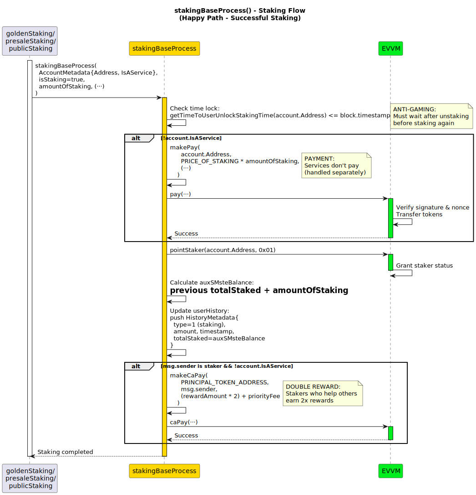
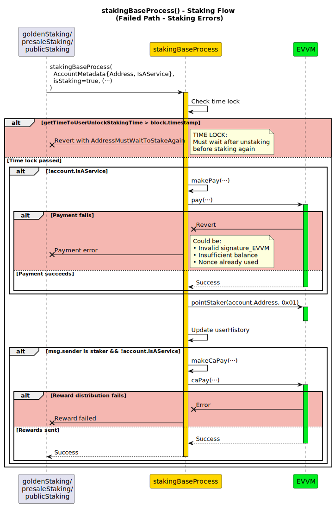
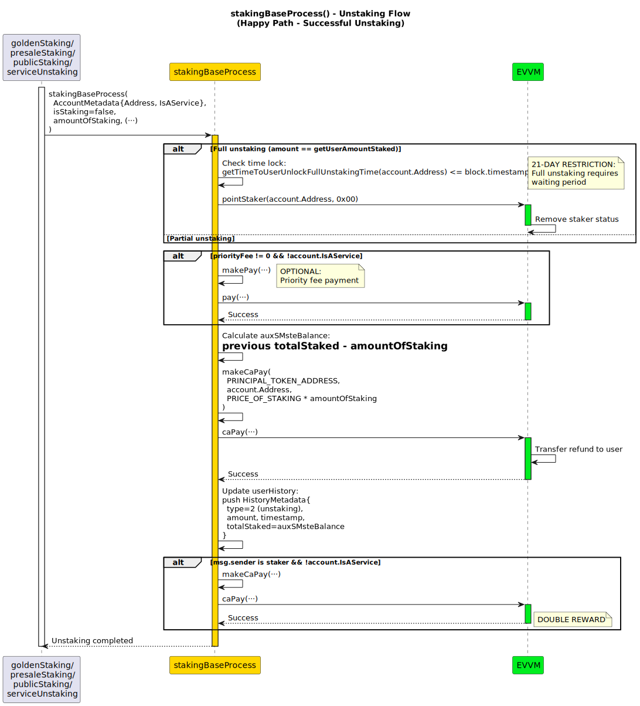
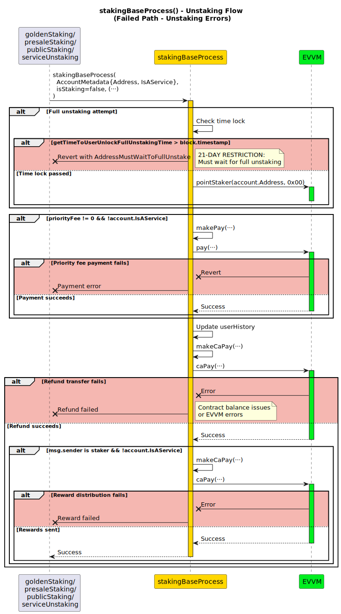

# stakingBaseProcess

**Function Type**: `internal`

The `stakingBaseProcess` function implements the core staking logic that handles both service and user staking operations. It processes payments, updates history, handles time locks, and manages EVVM integration for all staking types.

## Parameters

| Parameter           | Type            | Description                                                    |
| ------------------- | --------------- | -------------------------------------------------------------- |
| `account`           | AccountMetadata | Metadata of the account performing the staking operation       |
| `isStaking`         | bool            | `true` = Stake (requires payment), `false` = Unstake (provides refund) |
| `amountOfStaking`   | uint256         | Amount of staking tokens to stake/unstake                      |
| `priorityFee_EVVM`  | uint256         | Priority fee for EVVM transaction                              |
| `nonce_EVVM`        | uint256         | Nonce for EVVM contract transaction                            |
| `priorityFlag_EVVM` | bool            | `true` = async EVVM transaction, `false` = sync               |
| `signature_EVVM`    | bytes           | Signature for EVVM contract transaction                        |

### AccountMetadata Structure

The `account` parameter uses the following struct:

```solidity
struct AccountMetadata {
    address Address;     // Address of the account
    bool IsAService;     // Boolean indicating if the account is a smart contract (service) account
}
```

## Workflow

The function processes two distinct operation types with different validation and execution flows:

- **Staking Operations**: Payment processing, cooldown validation, and stake assignment
- **Unstaking Operations**: Conditional payments, token refunds, and stake removal

## Staking Process

1. **Re-Staking Cooldown Check**: Verifies `getTimeToUserUnlockStakingTime(account.Address) <= block.timestamp`, reverts with `AddressMustWaitToStakeAgain()` if cooldown period hasn't elapsed
2. **Payment Processing**: 
   - **For Users (!account.IsAService)**: Calls `makePay(account.Address, PRICE_OF_STAKING * amountOfStaking, priorityFee_EVVM, priorityFlag_EVVM, nonce_EVVM, signature_EVVM)`
   - **For Services (account.IsAService)**: Skips payment processing (already handled in preparation phase)
3. **Staker Status Assignment**: Sets `Evvm(EVVM_ADDRESS).pointStaker(account.Address, 0x01)` to mark as active staker
4. **Balance Calculation**: Calculates new total stake:
   - **First time staking**: `auxSMsteBalance = amountOfStaking`
   - **Additional staking**: `auxSMsteBalance = lastTotalStaked + amountOfStaking`
5. **History Update**: Pushes `HistoryMetadata` with transaction type `bytes32(uint256(1))`, amount, timestamp, and total staked
6. **Executor Rewards**: If `msg.sender` is a staker and `!account.IsAService`, pays `(getRewardAmount() * 2) + priorityFee_EVVM` via `makeCaPay()`




## Unstaking Process

1. **Full Unstaking Validation**: If `amountOfStaking == getUserAmountStaked(account.Address)` (complete unstaking):
   - **Cooldown Check**: Verifies `getTimeToUserUnlockFullUnstakingTime(account.Address) <= block.timestamp`, reverts with `AddressMustWaitToFullUnstake()` if cooldown not met
   - **Status Removal**: Sets `Evvm(EVVM_ADDRESS).pointStaker(account.Address, 0x00)` to remove staker status
2. **Optional Priority Payment**: If `priorityFee_EVVM != 0 && !account.IsAService` (user unstaking with priority fee):
   - **Priority Fee Payment**: Calls `makePay(account.Address, 0, priorityFee_EVVM, priorityFlag_EVVM, nonce_EVVM, signature_EVVM)` (amount is 0, only priority fee is paid)
3. **Balance Calculation**: `auxSMsteBalance = lastTotalStaked - amountOfStaking`
4. **Token Refund**: Calls `makeCaPay(PRINCIPAL_TOKEN_ADDRESS, account.Address, PRICE_OF_STAKING * amountOfStaking)` to return tokens
5. **History Update**: Pushes `HistoryMetadata` with transaction type `bytes32(uint256(2))`, amount, timestamp, and remaining total staked
6. **Executor Rewards**: If `msg.sender` is a staker and `!account.IsAService`, pays `(getRewardAmount() * 2) + priorityFee_EVVM` via `makeCaPay()`




:::info

For detailed information about the helper functions, refer to:
- [makePay](../05-makePay.md) - Handles EVVM payment processing
- [makeCaPay](../04-makeCaPay.md) - Handles token distributions
- [Getter Functions](../06-Getters.md) - Time lock and balance functions

:::
